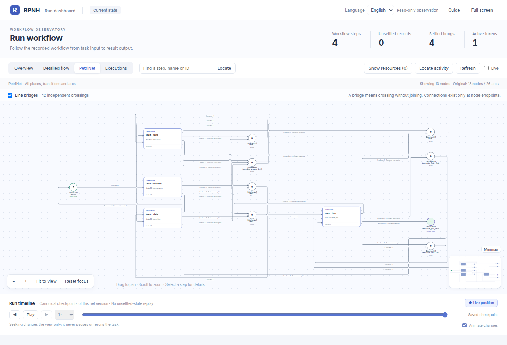

# RPNH Harness

English | [中文](README_ZH.md)

[See the graph](#see-a-multi-agent-run) · [Quick start](#quick-start) ·
[Examples](#example-catalog) · [Frontends](#frontends-and-host-integrations) ·
[Documentation](#documentation) · [Technical report](docs/technical-report.md)

RPNH is a provider-neutral agent execution framework for composing language
models, native tools and reusable workflows. A durable **Registry** records
execution and resource history; a typed **Petri net** determines when work is
eligible to run and how settled outputs enable later steps.

The same runtime supports a conversational main session, isolated child tasks,
multi-Agent workflows, versioned workspace resources and read-only inspection.
Basic, Codex, OpenCode and DSH are presentation or host surfaces around that
runtime—not separate owners of model, workspace or recovery state.

| At a glance | Current boundary |
|---|---|
| Platform | Linux or WSL2, Python 3.11+ |
| Source candidate | `0.1.0rc2` development candidate; older public binaries are `v0.1.0rc1` |
| Installation | Source checkout or GitHub Release wheel/sdist |
| Models | User-owned provider and exact-model catalog; no route is preselected |
| Execution | Main session plus independent task/workflow Registries |
| Observation | Terminal projections and a local read-only PetriNet dashboard |
| Recovery | Owner-stop resume and user-selected checkpoint reopen |

Public record dated 2026-10-06: freeze04 first18 has 5 PASS / 9 FAIL / 4 BLOCKED; separate repair4 has 1 PASS / 3 FAIL. The old 14 scored tasks were not rerun. [Results and limits](examples/automationbench/PUBLIC_RESULTS_20261006.md).

Explicit opt-in [author/graph interfaces](docs/reference/declarations.md), [Workset and normal-child roots](docs/reference/normal-child-root-contract.md), and [read-only source queries](docs/guides/source-queries.md) are integrated. [Finite validation](docs/guides/release-validation.md) is not full HOST/I00–I10/advanced25 acceptance; the historical freeze04 browser window was BLOCKED.

Offline preparation and inspection are available through [portable package preview and exact local locks](docs/guides/portable-packages.md), [HOST declaration diagnostics](docs/guides/host-readiness.md), and [checkpoint comparison](docs/guides/checkpoint-comparison.md). Package commands use the installed `rpnh` entry; the HOST diagnostic is an explicit Python API. These interfaces inspect materials and recorded facts without granting execution authority.

See [curated results](docs/results/README.md) for historical application scores and zero-model runtime checks. Each record keeps its tested source and conditions; these older windows do not certify a later combined product or a new rc2 binary release.

## See a multi-agent run

[Controlled managed tools](docs/controlled-managed-tools.md) covers exact result
paging, bounded parallel calls, isolated Python programs, read-only result
evidence and source preflight. These capabilities use explicit HOST policies;
existing tool catalogs and benchmark comparison conditions retain their defaults.

This dashboard comes from the checked-in `parallel` example after a completed
Registry run. `prepare` enables two independent Agents; `join` becomes eligible
only after both registered products are available.


After completing [Quick start](#quick-start), reproduce it without a provider or
API credential:

```bash
DEMO_ROOT="$(mktemp -d "${TMPDIR:-/tmp}/rpnh-readme.XXXXXX")"
python -m examples.workflow_patterns.run \
  --scenario parallel --run-dir "$DEMO_ROOT/parallel"
rpnh net --run "$DEMO_ROOT/parallel" --view --no-open
```

Overview emphasizes Agent-to-Agent structure. The PetriNet view of the same run
shows the transitions, handoff places, fan-out arcs and all-input join used by
execution:



These are real graph projections with aggregate execution state and controls;
only run-specific checkpoint identities and local timestamps were removed from
the public images. The dashboard is read-only. Registry terminal evidence and a
registered final result—not a picture or process exit—establish completion.

## What RPNH provides

- **Agents and existing code in one workflow.** Model nodes can reason and
  communicate while native plugins perform calculations or existing business
  logic against declared inputs and outputs.
- **Explicit concurrency and joins.** Petri-net places, arcs and tokens express
  fan-out, synchronization, resource reads and completion conditions without
  reducing execution to a serial chat transcript.
- **Independent work with one entry point.** The main session can create,
  inspect, message, stop and reopen child tasks. Each child retains its own
  Registry, execution state and result.
- **Versioned workspace evidence.** Resource versions connect inputs and
  products to their executions. Settlement records per-path create, update and
  delete history while preserving conflicts between concurrent revisions.
- **Provider- and frontend-neutral ownership.** Users configure their own model
  routes. Supported frontends share RPNH execution semantics instead of
  reimplementing provider, Registry, workspace or recovery behavior.

## Quick start

Choose the source or release deliberately:

- **Current source:** this checkout is the `0.1.0rc2` development candidate. Build
  it from the selected source commit; no new rc2 binary release is claimed here.
- **Older binaries:** the [`v0.1.0rc1` prerelease](https://github.com/Deng-0119/RPNH/releases/tag/v0.1.0rc1)
  contains the 2026-09-29 wheel/sdist. These do not contain later `main` features.
- **Historical benchmark snapshot:** [`benchmark-baseline-2026-10-06`](https://github.com/Deng-0119/RPNH/releases/tag/benchmark-baseline-2026-10-06)
  is source-only at `f58a0f061d1daf4c09fc96c43237c613cc43f439`; it is not a new
  runtime binary release or proof that every runtime journey passed.

On Linux or WSL2, use the selected reviewed source checkout and run from its
root. An ordinary clone of public `main` does not retrieve unpublished candidate
changes. Record the selected commit and use a fresh environment; see
[installation](docs/guides/installation.md) for wheel and upgrade checks.

```bash
git rev-parse HEAD
python3 -m venv .venv
. .venv/bin/activate
python -m pip install .
rpnh --help
rpnh config init
rpnh config build
rpnh config build --check
```

These commands do not call a model. The initial provider/model catalog is
empty. Add an authorized provider and exact model through the
[model configuration guide](docs/guides/models.md); all supported configuration
keys and their defaults are indexed in the
[configuration reference](docs/guides/configuration.md).

### 1. Run a local tool without a model

The bundled `demo/add` plugin exercises admission, execution, registered output
and terminal evidence:

```bash
python -m pip install ./examples/native_plugin
rpnh plugins --config examples/native_plugin/plugins.json check
DEMO_ROOT="$(mktemp -d "${TMPDIR:-/tmp}/rpnh-demo.XXXXXX")"
RUN_DIR="$DEMO_ROOT/run"
rpnh plugins --config examples/native_plugin/plugins.json run demo/add \
  --input examples/native_plugin/input.json --run-dir "$RUN_DIR"
```

The input is `{"left": 2, "right": 3}` and the returned JSON contains
`output.value` equal to `5`, the run directory and a terminal-evidence reference.

### 2. Inspect the run

```bash
: "${RUN_DIR:?Set an existing run directory}"
rpnh net --run "$RUN_DIR"
rpnh net --run "$RUN_DIR" --show-resources
rpnh net --run "$RUN_DIR" --resources-only
rpnh net --run "$RUN_DIR" --view --no-open
```

The default terminal projection hides resource places. Explicit resource views
show only resources declared by the actual net. The final command starts the
local read-only dashboard and prints its loopback address. See the
[dashboard tutorial](docs/guides/viewer.md) for every view, control and symbol.

### 3. Start a model-backed main session

After building an authorized execution profile:

```bash
rpnh --frontend basic
```

Use `/agent` for an independent task, `/workflow` to ask the Designer to create
a workflow, and `/tasks` to list children. `/switch` changes the selected task;
`/task ID status` and `/task ID result` inspect its state and output.
`/task ID checkpoints` lists committed cuts, and `/task ID reopen CHECKPOINT
[:: REASON]` appends a new execution generation from a user-selected cut in the
same Registry/run. See [usage](docs/guides/usage.md) and the
[checkpoint recovery procedure](docs/guides/checkpoint-recovery.md).

## Example catalog

| Example | What it demonstrates | Instructions |
|---|---|---|
| Native calculation | Local plugin, registered input/output and zero model calls | [Native tool](examples/native_plugin/README.md) |
| Model–program–model calculation | Agent nodes around a native summary operation | [Hybrid summary](examples/hybrid_summary/README.md) |
| Serial, parallel, document and long workflows | Multi-Agent topology, bounded parallelism, joins and timeline checkpoints | [Workflow gallery](examples/workflow_patterns/README.md) |
| Independent tasks | Separate child Registries controlled from one main session | [Task workspace](examples/task_workspace/README.md) |
| Native Petri-net operations | Definition composition and live whole-net replacement | [Net operations](examples/net_operations/README.md) |
| Basic, Codex, DSH and OpenCode | One provider-neutral semantic task through four host surfaces | [Installed adapter task](docs/guides/examples.md) |
| JB clinical packet | Public clinical sources, document/data analysis and a Designer-authored graph | [Reproduce JB](examples/jb_steering_packet/README.md) |
| 3-DOF powered descent | Numerical implementation, independent validation and a Designer-authored graph | [Reproduce 3-DOF](examples/three_dof_powered_descent/README.md) |
| HarnessAudit Office benchmark | Native agent teams, registered business tools, original scoring and retained results | [Office example](examples/harnessaudit_office/README.md) |
| RRSI v0.6 Policy evolution | Two-round Policy evolution with independent child Registries and score/cost selection | [RRSI example](examples/rrsi_v06/README.md) |
| AutomationBench public workflows | Historical pilot, freeze04 first18 and separate repair4 with condition-specific scores and limits | [AutomationBench example](examples/automationbench/README.md) |

Execution-gallery pages identify the origin of their actual dashboard images.
Benchmark examples supply scored records and viewer commands for newly
generated runs; they do not claim an archived screenshot. The
[complete example guide](docs/guides/examples.md) records commands, expected
results and evidence boundaries for calculation, document, serial, parallel,
long-process and independent-task examples. The
[source example index](examples/README.md) provides the repository-level map.

A wheel built from this source candidate exports `native_plugin`,
`hybrid_summary` (including its shared fixture and plugin), `compose_serial` and
`package_reuse`, as well as the default provider-neutral `adapter_task`.
Follow [export and customization](docs/guides/examples.md#export-an-example-and-make-it-yours)
or the complete [runnable v2 package tutorial](docs/guides/package-reuse-example.md).
The older rc1 wheel contains only the adapter export. Exporting never configures
a provider or contacts a model:

```bash
EXAMPLE_ROOT="$(mktemp -d "${TMPDIR:-/tmp}/rpnh-example-parent.XXXXXX")/adapter-task"
rpnh examples list
rpnh examples export --output "$EXAMPLE_ROOT"
```

The exported guides share one task and expected semantic result across hosts.
A model call occurs only after the user supplies an authorized execution profile
and submits the task; raw runs remain private.

## Execution and recovery model

A declared operation is admitted before dispatch. Its returned products are
registered and settled before downstream work relies on them, and a declared
terminal binding identifies the final result. Frontends and the dashboard read
the same durable records.

Harness-owned file materialization and workspace finalization run as subordinate
execution Petri nets inside the same Registry. They separate implementation
mechanics from the Designer-authored business graph while preserving exact
checkpoint-to-result evidence. Registry validation enforces identity, ordering,
references and atomic closure; retry, remediation and whether a failed tool
action is acceptable remain explicit runtime or application policy.

An owner stop checkpoints the current run without turning unfinished work into
success. `resume` continues the latest owner-stopped cut. `reopen` selects any
committed checkpoint and appends a new execution generation while retaining
later history and files as immutable evidence. Rolling a main conversation back
to its previous completed turn does not delete independent child Registries.
Unknown provider submissions are recorded rather than silently replayed.

See the [architecture](docs/architecture/design.md) and
[runtime reference](docs/reference/runtime-registry.md) for token semantics,
workspace settlement, execution nets and workflow revision.

## Frontends and host integrations

| Entry | Purpose |
|---|---|
| `rpnh --frontend basic` | Built-in terminal for the main session and independent task controls |
| `rpnh --frontend codex` | Pinned Codex presentation; see the [adapter guide](docs/guides/adapters.md) |
| `rpnh --frontend opencode` | OpenCode 1.18.32 presentation; see the [OpenCode guide](docs/guides/opencode.md) |
| `rpnh-dsh` | Optional pinned DSH host integration; see the [DSH guide](docs/guides/dsh.md) |

Basic, Codex and OpenCode are sequential presentations of one direct MainSession
root. Create it with `--session-dir`; after the current frontend exits, reopen
the exact path with `--resume` and another frontend. State is not copied into
frontend-specific sessions, and the shared owner lease rejects concurrent
writable presentations. DSH is a registered host integration with its own
session surface. RPNH retains model selection and managed-execution authority in
all cases.

## Documentation

[English index](docs/index.md) · [中文文档](docs/index_ZH.md)

| Goal | Start here |
|---|---|
| Understand the design before testing | [Technical report](docs/technical-report.md) |
| Install and run | [Installation](docs/guides/installation.md), [examples](docs/guides/examples.md), [usage](docs/guides/usage.md) |
| Configure the runtime | [Configuration](docs/guides/configuration.md), [models](docs/guides/models.md), [usage and recovery](docs/guides/usage.md) |
| Build an application | [Customization and plugins](docs/guides/customization.md), [native Petri-net operations](docs/guides/net-operations.md), [declarations](docs/reference/declarations.md) |
| Understand execution | [Dashboard](docs/guides/viewer.md), [architecture](docs/architecture/design.md), [Registry/runtime](docs/reference/runtime-registry.md), [sessions and Agents](docs/reference/agents.md) |
| Integrate a host | [Frontend and host adapters](docs/guides/adapters.md), [extension and observation interfaces](docs/reference/extensions-observation.md) |
| Operate or contribute | [Troubleshooting](docs/guides/troubleshooting.md), [development](docs/guides/development.md), [contributing](CONTRIBUTING.md), [security](SECURITY.md), [changelog](CHANGELOG.md), [release validation](docs/guides/release-validation.md) |

## Validation and development

Use focused deterministic offline tests for a local code change. Run a broader
suite only when a release-wide change can affect those additional modules.
Provider-backed checks require separate authorization and a recorded route and
call budget; offline passing results are not evidence that a live route works.
Keep credentials, local profiles and generated run data outside Git. See the
[development guide](docs/guides/development.md) and the dated
[validation record](docs/guides/release-validation.md).

## License

RPNH uses the [MIT License](LICENSE). Bundled or pinned third-party components
retain their own licenses; see [THIRD_PARTY_NOTICES.md](THIRD_PARTY_NOTICES.md)
and the notices shipped with optional integrations.
