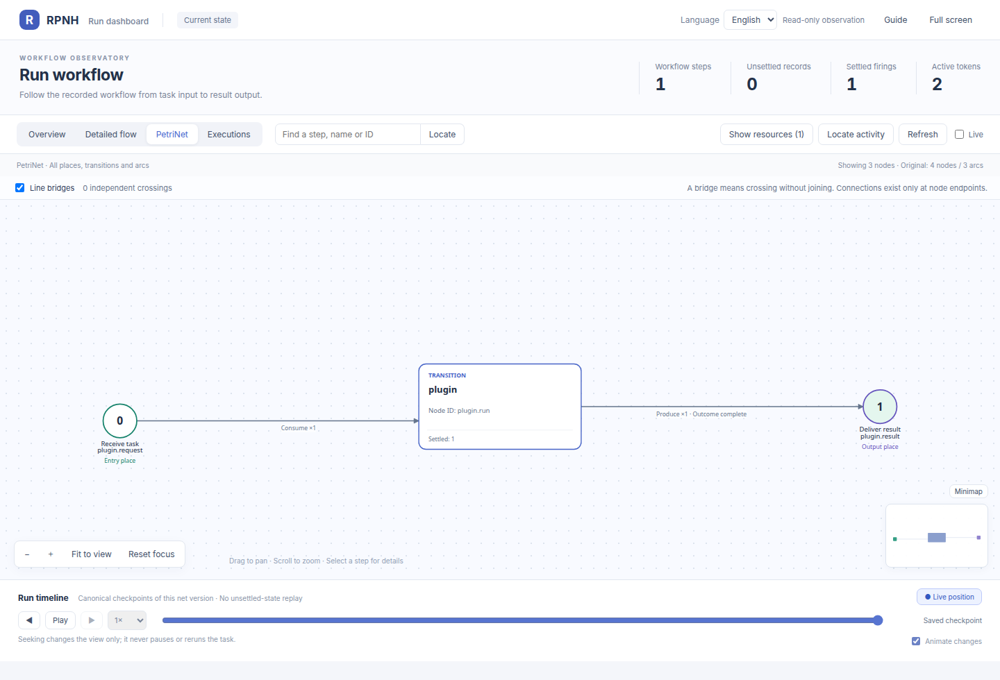
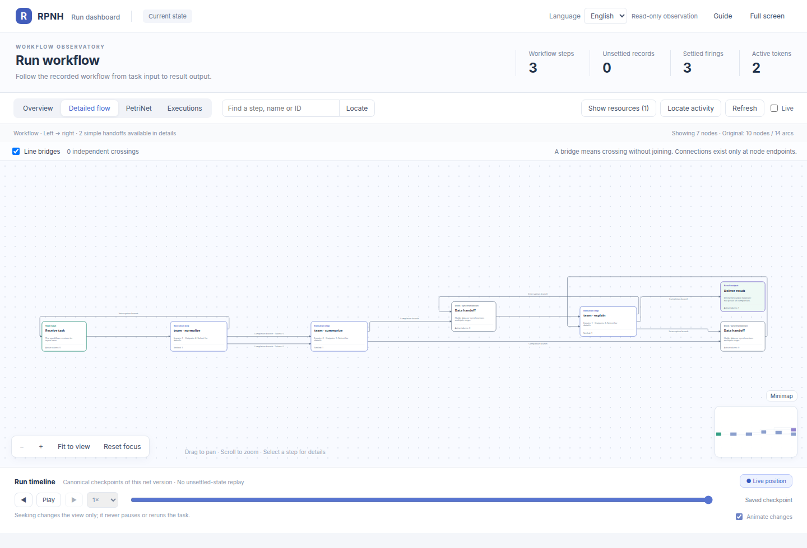
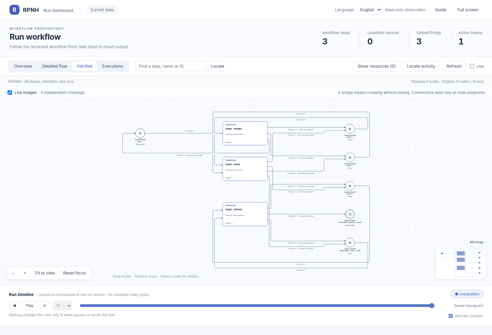
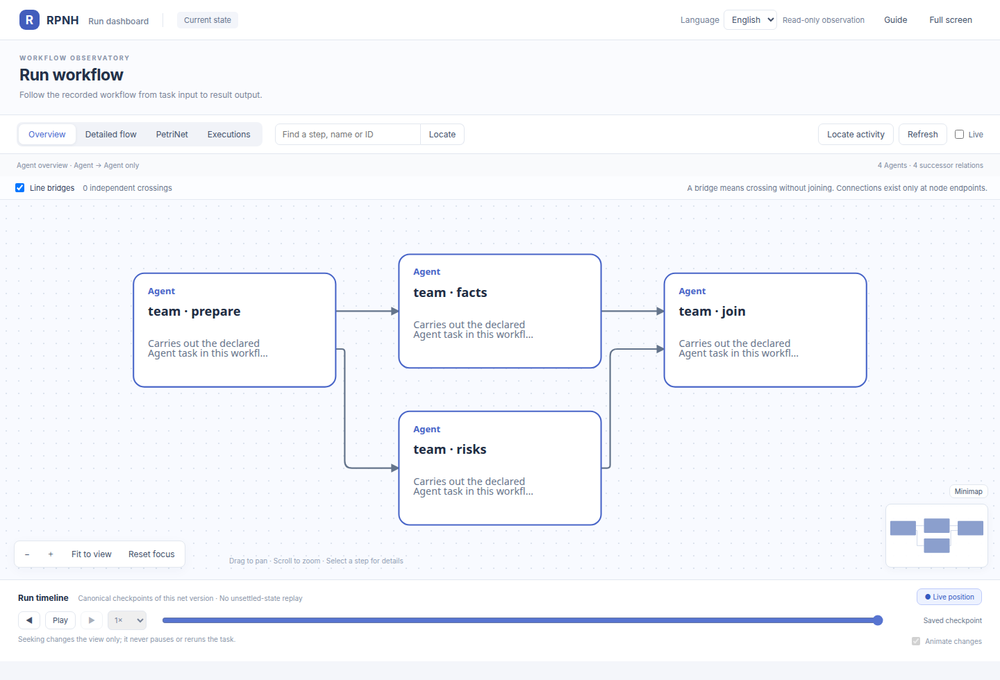
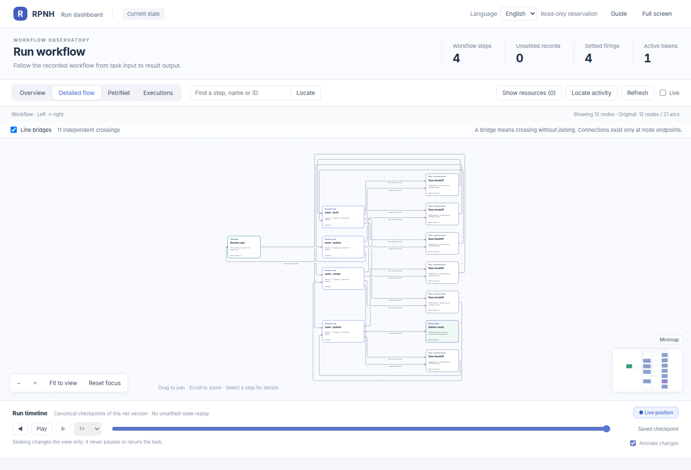
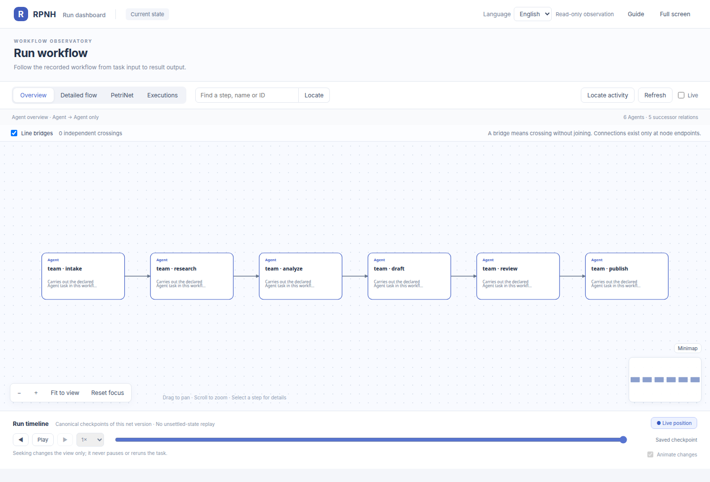
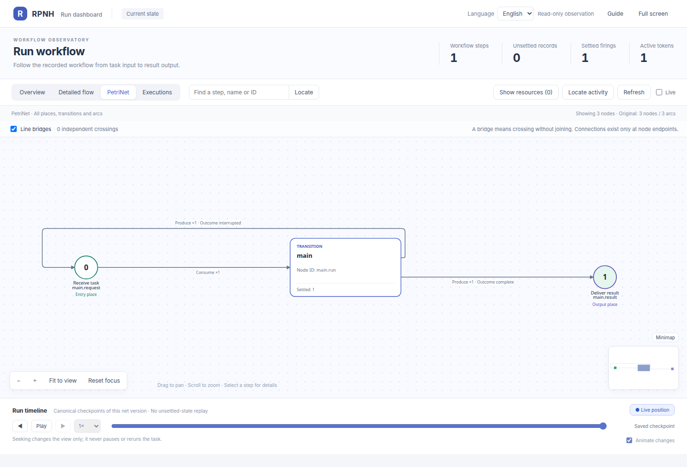
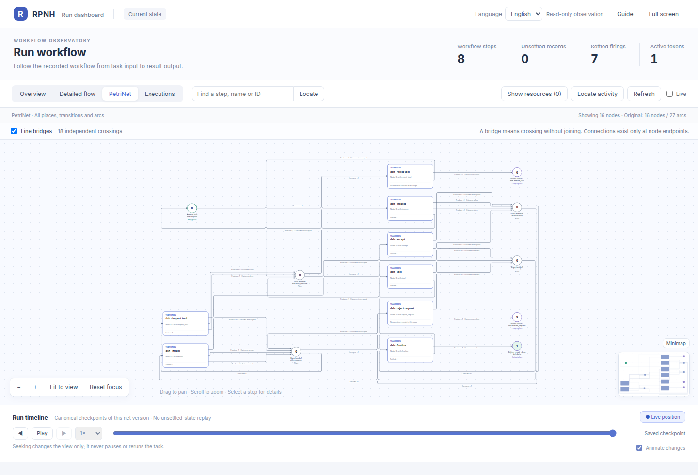
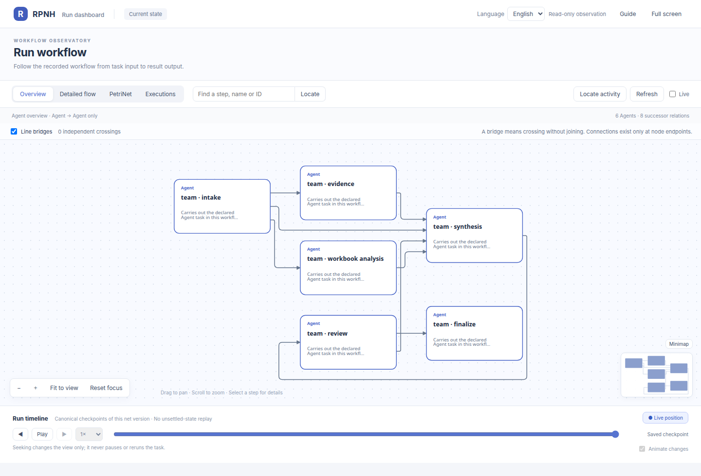
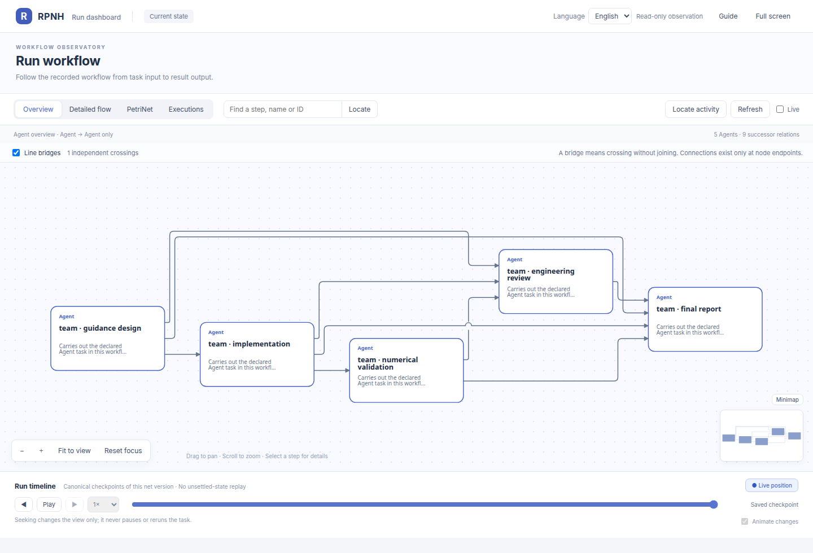

[English](examples.md) | [中文](examples_ZH.md)

# RPNH example catalog

The examples are organized by user task rather than implementation package.
Every runnable workflow below creates a real Registry and PetriNet projection.
A scripted model is a deterministic protocol fixture, not evidence of
language-model reasoning. Provider-backed examples are explicitly separated.
Commands and recovery semantics describe current `main`; screenshots and
acceptance tables retain the date and exact boundary of the run that produced
them instead of being silently relabelled as current execution.

| I want to see | Start here | Default |
|---|---|---|
| Local arithmetic and registered resources | Example 1, native plugin | No model |
| Serial calculation with a native operation | Example 2, hybrid summary | Scripted |
| Serial versus parallel topology | Example 3, workflow patterns | Scripted |
| A document moving through review | Example 3, `document` | Scripted |
| A longer run with more checkpoints | Example 3, `long_process` | Scripted |
| Independent background tasks | Example 4, task workspace | Scripted |
| The same real semantic task through each host | Example 5, installed task | Authorized profile |
| A real clinical document/data packet | Example 6, JB steering packet | Authorized profile |
| A real numerical optimal-control task | Example 7, 3-DOF powered descent | Authorized profile |
| Recursive role evolution with independent child Registries | Example 8, RRSI v0.6 application | Authorized profile |

## Prerequisites

Use Linux or WSL2, Python 3.11 or newer, and a source checkout. From its root,
create an environment and install both packages:

```bash
python3 -m venv .venv
. .venv/bin/activate
python -m pip install .
python -m pip install ./examples/native_plugin
rpnh --help
rpnh plugins --config examples/native_plugin/plugins.json check
```

The generated run directories below are private operational data. Keep them
outside the repository. Remove the enclosing `DEMO_ROOT` after inspection if
you no longer need the Registry evidence.

## Example 1: native tool and registered instruction

This path needs no model profile or credential. The parent directory may exist,
but each run directory must be absent before `run` starts.



```bash
DEMO_ROOT="$(mktemp -d "${TMPDIR:-/tmp}/rpnh-native.XXXXXX")"
ADD_RUN="$DEMO_ROOT/add-run"
INSTRUCTION_RUN="$DEMO_ROOT/instruction-run"
rpnh plugins --config examples/native_plugin/plugins.json list
rpnh plugins --config examples/native_plugin/plugins.json run demo/add \
  --input examples/native_plugin/input.json --run-dir "$ADD_RUN"
rpnh plugins --config examples/native_plugin/plugins.json run demo/instruction \
  --input examples/native_plugin/instruction-input.json \
  --run-dir "$INSTRUCTION_RUN"
rpnh net --run "$ADD_RUN" --show-resources
```

The first JSON result has `output.value` equal to `5`, a non-null
`terminal_evidence_ref`, and `actual_model_call_counts[0]` equal to `0`. The
second result returns the instruction text plus run-registered resource and
resource-version identities. Change the two numbers in a copied input file and
use another absent run directory to see a new result.

All three demo operations explicitly cap canonical results at 1 KiB. That is
not a copied DSH limit: bounded integer inputs make the largest legal add and
1,000-item summary much smaller than 1 KiB, while the instruction result has a
fixed resource shape. A different operation must derive its own limit from its
legal output domain.

## Example 2: model, program, model

The graph in `examples/hybrid_summary/graph.json` is loaded by the launcher; it
is not display-only configuration. Its three nodes are:

```text
normalize input -> demo/summarize -> explain registered summary
```



The default mode generates a temporary local-process execution selection. The
fixture first reads each exact Located input through the AgentLoop tool
contract, then returns deterministic tool calls. Plugin execution, graph
lowering, Registry publication, resource delivery and terminal settlement are
ordinary RPNH execution.

Each model node has a four-turn cap. This accommodates a Located-input read and
bounded correction of one rejected publication while remaining finite; it is
not a provider retry policy.

```bash
DEMO_ROOT="$(mktemp -d "${TMPDIR:-/tmp}/rpnh-hybrid.XXXXXX")"
RUN_DIR="$DEMO_ROOT/run"
python examples/hybrid_summary/run.py --run-dir "$RUN_DIR"
rpnh net --run "$RUN_DIR" --format json
rpnh net --run "$RUN_DIR" --show-resources
rpnh net --run "$RUN_DIR" --view --no-open
```

The result reports three batches, total `36`, mean `12`, minimum `9` and
maximum `15`. A second fresh run proves that the native result is not a fixed
playback:

```bash
VARIANT_RUN="$DEMO_ROOT/variant-run"
python examples/hybrid_summary/run.py \
  --input examples/hybrid_summary/variant-input.txt \
  --run-dir "$VARIANT_RUN"
```

That output changes to total `39` and mean `13`. To use a separately authorized
real model, pass the existing exact execution selection without changing the
graph or plugin:

```bash
: "${EXECUTION_CONFIG:?Set an authorized execution selection}"
REAL_RUN="$(mktemp -d "${TMPDIR:-/tmp}/rpnh-real-parent.XXXXXX")/run"
python examples/hybrid_summary/run.py --execution "$EXECUTION_CONFIG" \
  --run-dir "$REAL_RUN"
```

This command can make paid or external calls. The example never selects a
provider/model, changes routes or falls back. Configure and authorize the route
using the [model guide](models.md) before running it.

## Example 3: serial, parallel, document and long workflows

One runner exposes four explicit graph shapes. These are completed tasks, not
declaration-only diagrams:

| Serial PetriNet | Parallel Agent overview |
|---|---|
|  |  |

| Document Detailed flow | Long-process overview |
|---|---|
|  |  |

The [workflow gallery](../../examples/workflow_patterns/README.md) also shows
the parallel run's complete PetriNet projection.

```bash
DEMO_ROOT="$(mktemp -d "${TMPDIR:-/tmp}/rpnh-patterns.XXXXXX")"
python -m examples.workflow_patterns.run --list
python -m examples.workflow_patterns.run \
  --scenario serial --run-dir "$DEMO_ROOT/serial"
python -m examples.workflow_patterns.run \
  --scenario parallel --run-dir "$DEMO_ROOT/parallel"
python -m examples.workflow_patterns.run \
  --scenario document --run-dir "$DEMO_ROOT/document"
python -m examples.workflow_patterns.run \
  --scenario long_process --run-dir "$DEMO_ROOT/long-process"
```

`parallel` has one fan-out, two independently enabled reviewers and an explicit
all-input join. `document` registers outline, draft, review and publication
products. `long_process` settles six Agent nodes, giving the dashboard more
canonical checkpoints to replay. Open any result directly:

```bash
RUN_DIR="$DEMO_ROOT/parallel"
rpnh net --run "$RUN_DIR"
rpnh net --run "$RUN_DIR" --view --no-open
```

Use `--execution "$EXECUTION_CONFIG"` to replace the scripted fixture with one
separately authorized exact profile. The runner does not choose or switch a
route. See the [source gallery instructions](../../examples/workflow_patterns/README.md)
and the [dashboard tutorial](viewer.md).

## Example 4: two independent tasks

Generate the scripted profile outside the repository and start a fresh basic
session:


```bash
DEMO_ROOT="$(mktemp -d "${TMPDIR:-/tmp}/rpnh-tasks.XXXXXX")"
python examples/task_workspace/prepare_profile.py \
  --output-dir "$DEMO_ROOT/profile"
rpnh --frontend basic --execution "$DEMO_ROOT/profile/execution.json" \
  --session-dir "$DEMO_ROOT/session"
```

The following block is entered at the RPNH prompt, not in the shell. Copy each
returned task ID before substituting `FIRST_ID` and `SECOND_ID`:

```text
/agent List exactly three data quality checks for a small batch table.
/switch main
/agent Task values: 4, 8, 12. Summarize the count, total and mean.
/tasks
/switch FIRST_ID
/task FIRST_ID status
/task FIRST_ID result
/task FIRST_ID net
/switch SECOND_ID
/task SECOND_ID status
/task SECOND_ID result
/task SECOND_ID net view --show-resources --no-open
/switch main
/quit
```

The two IDs and run directories differ. Switching changes only process-local
focus; it does not stop, duplicate or replace a child. `status` supplies the
selected child's `run_dir`. After leaving the frontend, that exact path can be
used with `rpnh net --run RUN_DIR`. The main session and each child retain
separate Registries; the main Registry stores child links.

To inspect current checkpoint controls, first let one child settle, then list
its exact cuts:

```text
/task FIRST_ID checkpoints
/task FIRST_ID reopen CHECKPOINT :: Re-run from this committed cut and verify the result.
/task FIRST_ID status
/task FIRST_ID result
```

Replace `CHECKPOINT` only with an ID returned for that task. `reopen` appends a
new execution generation in the same Registry/run; it does not delete later
history. Selecting an already-terminal cut closes the new generation without a
model call. Selecting an earlier cut can execute the scripted adapter again.
Use `/task ID resume` instead when continuing the latest owner-stopped cut.

## Example 5: one installed task through every host

Every wheel contains a provider-neutral semantic task plus separate instructions
for Basic, Codex 0.155.0, pinned DSH and OpenCode 1.18.32. Exporting or listing
it makes no provider call:

| Basic | Codex 0.155.0 |
|---|---|
|  |  |

| Pinned DSH | OpenCode 1.18.32 |
|---|---|
|  |  |

These are read-only PetriNet views of the accepted Registry runs, not host TUI
screenshots. Their different execution shapes remain visible; exact checkpoint
identities are omitted from the public images.

```bash
EXAMPLE_PARENT="$(mktemp -d "${TMPDIR:-/tmp}/rpnh-adapter-example.XXXXXX")"
EXAMPLE_ROOT="$EXAMPLE_PARENT/task"
rpnh examples list
rpnh examples export --output "$EXAMPLE_ROOT"
cd "$EXAMPLE_ROOT"
```

Read `README.md`, then choose exactly one host directory. Each guide requires
an existing user-owned `EXECUTION_CONFIG`, a fresh operational root and one
explicit task submission. No bundled file contains a provider, endpoint,
credential or model choice. The common task computes count, total, mean,
minimum and maximum for the same three batch values; it is a semantic task,
not a READY health marker.

Copy only the assistant's JSON object to `answer.json` and verify the task result:

```bash
rpnh examples verify --result answer.json
```

That check does not establish execution success by itself. Confirm the host's
Registry terminal evidence, final registered result, selected-profile provenance
and physical-call record. Basic, Codex and OpenCode share MainSession authority;
DSH uses its own registered host turn through the same provider adapter. The
example does not pretend that DSH exposes Basic-only task/workflow controls.

The bundled per-host `evidence.json` files record the focused 2026-09-26
acceptance run:

| Host | Logical turns | Successful physical responses | Registry authority | Semantic result |
|---|---:|---:|---|---|
| Basic | 1 | 2 | PASS | PASS |
| Codex 0.155.0 | 1 | 2 | PASS | PASS |
| pinned DSH | 1 | 1 | PASS | PASS |
| OpenCode 1.18.32 | 1 | 2 | PASS | PASS |

All seven successful physical responses used the same explicitly selected
`local_process` route and exact `gpt-5.6-terra` model. There were zero health
probes and zero route/model switches. A MainSession logical turn may contain
multiple physical generations; DSH's registered host turn required one. The
OpenCode presentation showed a conservative reconciliation notice while the
turn was pending and later displayed the committed answer plus its normal
no-child-decision annotation. Registry terminal/final-result evidence and the
semantic verifier both passed. Raw Registries, identifiers, paths and transcripts
remain private and are not represented by these summaries.

## Example 6: JB clinical steering packet



This real task downloads its article, statistical analysis plan and data
workbook from official PLOS sources into a repository-external directory. A
preparation script converts them into one exact registered task packet. The
main agent must design the graph; the example contains no fixed workflow and no
provider/model selection. An offline aggregate analyzer supplies reproducible
baseline, Kaplan-Meier-style and sample-size checks without publishing
participant rows.

Follow the complete [JB reproduction guide](../../examples/jb_steering_packet/README.md).

## Example 7: 3-DOF powered descent



This real numerical task registers a compact public problem statement and a
solver-independent trajectory verifier. The main agent chooses both graph and
numerical method. Acceptance requires the generated implementation to run and
the resulting trajectory to satisfy terminal, dynamics and path checks; a
solver exit status is insufficient.

Follow the complete [3-DOF reproduction guide](../../examples/three_dof_powered_descent/README.md).

## Example 8: RRSI v0.6 application

This provider-neutral application runs Analyst, Digester, Proposer, Critic and
Policy occurrences as independent RPNH child Registries. The checked-in timeout
fixture exercises a frozen two-round local protocol and the public RRSI
selection rule; it is not an official paper benchmark domain or result.

The example contains no execution profile or archived run. Its offline tests
use scripted input ports; a real campaign requires a separately authorized,
user-owned execution profile. Follow the complete
[RRSI application guide](../../examples/rrsi_v06/README.md).

## What to inspect and change

- Default net output hides resource nodes; `--show-resources` displays only
  resources declared by the actual net.
- Change the two numbers in the native input, the batch values in an input text,
  or the task prompts. Always choose a new run/session directory.
- A missing plugin field or an empty summary list is rejected by its declared
  schema and must not be described as a successful run.
- The dashboard is read-only and listens on loopback by default. Close the
  process you started when inspection is complete. See the
  [dashboard guide](viewer.md).

The accepted reference boundary is in [examples validation](examples-validation.md).
It distinguishes deterministic fixtures, earlier authorized provider calls and
current focused compatibility checks; none substitutes for validating a user's
own route.
