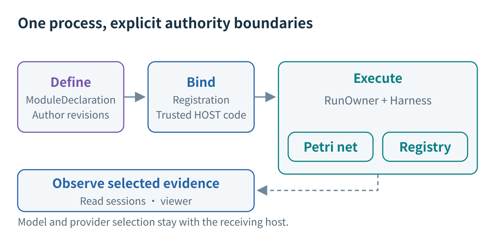
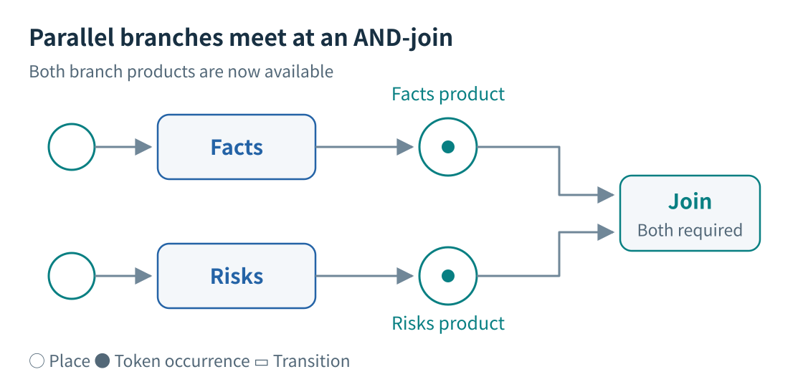
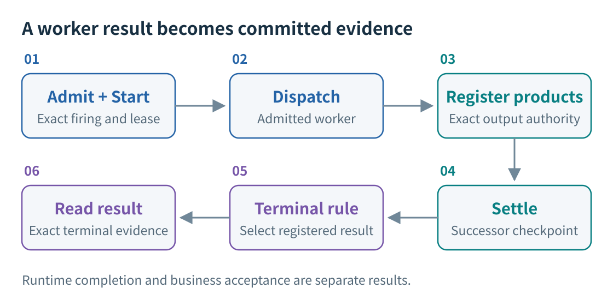
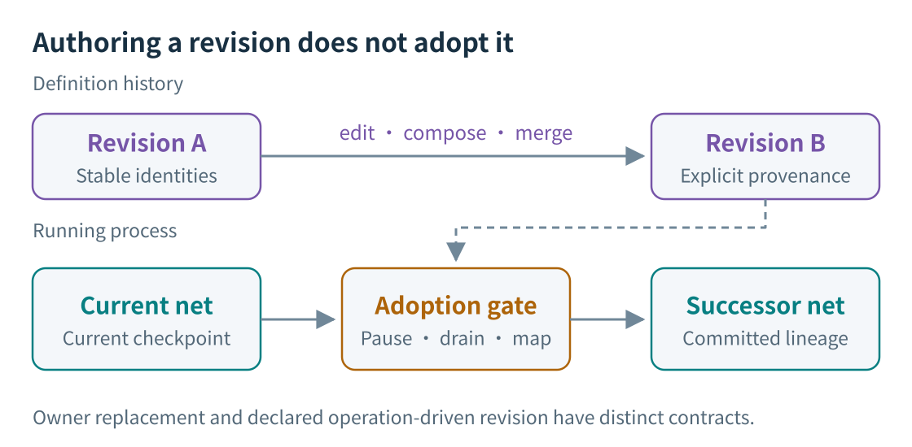
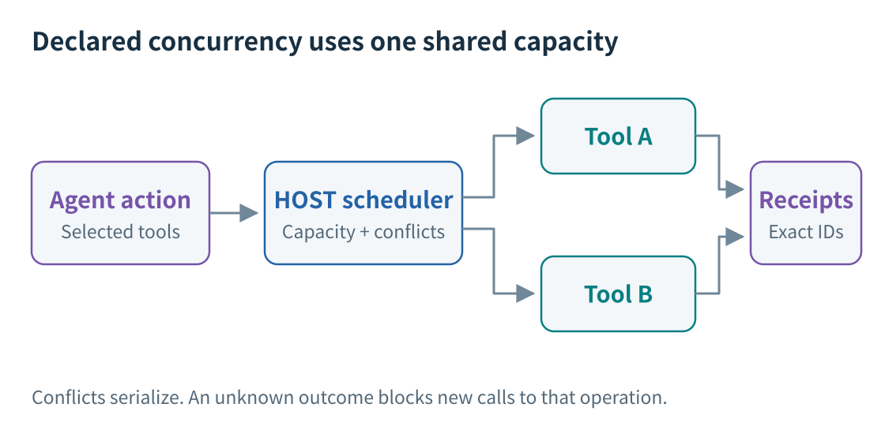
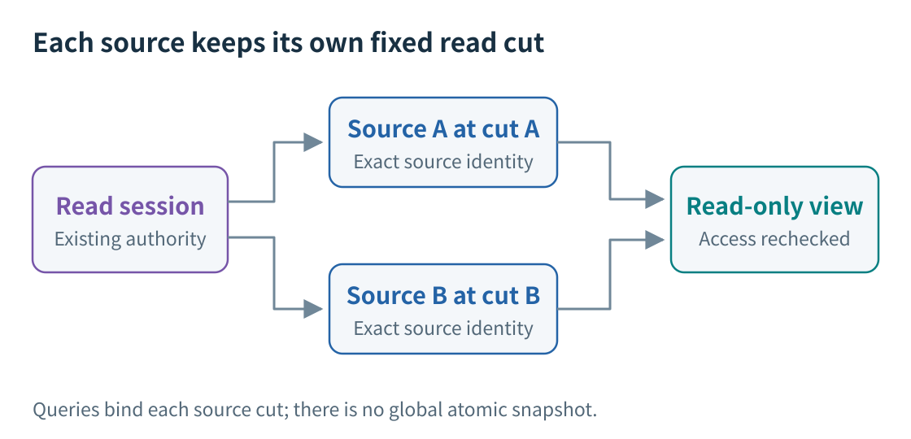
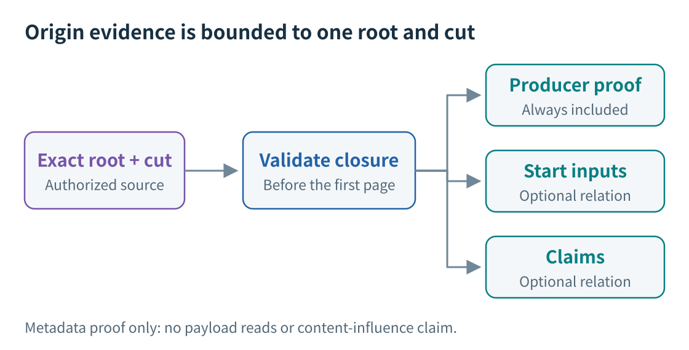
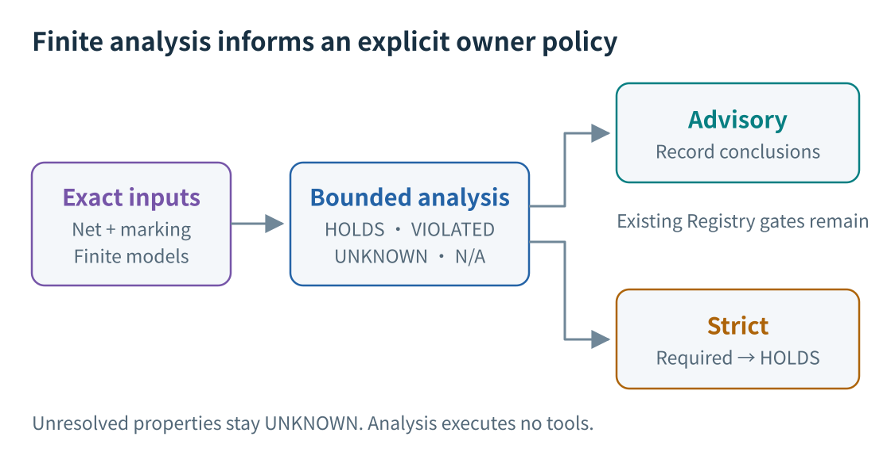

English | [中文](technical-report_ZH.md) | [Documentation](index.md)

# RPNH Technical Report

## Executable processes for Agents and programs

**Updated:** 2026-10-10. **Implementation snapshot:**
[`a6f242ea187fadcef81a8c1e95377fec616dc840`][snapshot].
Historical tests retain their own source identities in [§10](#10-historical-results-and-their-limits).
This report update ran no runtime, model or benchmark experiments.

RPNH is a provider-neutral harness for combining language-model Agents, native
programs and reusable workflows. A typed process defines dependencies and outcomes;
trusted host registration supplies implementations; Registry and Petri-net state
jointly constrain execution. Definitions can be revised and reused, while exact
products, checkpoints and source-qualified reads preserve a reviewable history.

The eight figures below explain one boundary at a time. They are conceptual
sketches, not screenshots or complete schemas. The linked references define the
full contracts. RPNH is useful where persistent outputs, explicit coordination or
controlled process changes matter; it also adds declaration and state-management
work. Published results do not establish comparative quality, speed or cost gains.

## 1. Separate the method from its execution

**Figure 1.** Four related assets: definition, trusted binding, execution evidence
and observation. The arrows show the relationship, not a separate execution engine.

- **Definition:** `ModuleDeclaration`, Agent graph source and immutable author revisions.
- **Binding:** `Registration` resolves declared keys to trusted host implementations.
  A declaration cannot invent executable Python locators; reading compiled data
  does not register callables.
- **Execution:** one `RunOwner`/`Harness` path admits and settles work. `Orchestrator`
  uses the host's existing owner, event loop, workers and dispatch services.
- **Observation:** selected Registry projections and read sessions remain read-only.

Basic, Codex and OpenCode are presentations of the same direct main-session root;
its shared lease prevents competing writable presentations. DSH is a registered
host integration. Independent child tasks own separate Registries, nets and owners;
subordinate execution nets share the business Registry for mechanics such as
workspace finalization. Authored assembly membership is a definition relationship.
The independent child-task entry does not establish a complete native parent-bound
launch-to-parent-completion chain. Its production transport boundary is not wired
at this snapshot. See the [parent–child boundary][parent-child].

Details: [architecture](architecture/design.md), [runtime contracts](reference/runtime-registry.md).
Code: [declarations][module], [registration][registration], [compiler][compiler],
[Orchestrator][orchestrator].

## 2. Eligibility comes from actual tokens and claims

**Figure 2.** A fragment of `prepare -> (facts || risks) -> join`, after both
branches have settled. Their separate input occurrences have been consumed;
both output occurrences enable the join. The final output place is omitted.

Typed places, weighted arcs, outcomes and resource claims determine which firings
are valid. Consume, read, borrow, guard, produce and return modes have different
contracts. Place fusion shares a place; it does not copy a product for broadcast.

`Harness.schedule_ready` rehydrates the current net and marking, installs active
claims and respects in-flight capacity. An injected selector may choose only a
distinct subset of the enabled transitions. Start is recorded before a worker is
submitted. Scheduling preference cannot make an invalid firing eligible.

`AgentWorkflowGraph` is the convenient dependency-graph interface; general
`ModuleDeclaration` supports richer typed contracts. Agent artifact labels route
text products, without proving business-data validity. At the graph boundary,
native-plugin nodes have one input and one output and exclude graph feedback.

Details: [declarations](reference/declarations.md), [workflow example](../examples/workflow_patterns/README.md).
Code: [Petri contracts][petri], [Harness][harness], [Agent graph][graph].

## 3. Settlement connects computation to durable state

**Figure 3.** The successful result path. Waiting, interruption, blocked execution
and terminal handoff have separate dispositions; not every settled firing ends a run.

A returned future is insufficient. The owner checks the exact firing, Start and
execution lease; registered products then support settlement of the outcome,
successor marking/checkpoint, applicable workspace publication and subordinate
execution mappings. The batch contract permits at most one firing
settlement/publication per transaction. Durable completed products win a racing
stop, avoiding replay of the completed semantic action.

`TaskControl.result` follows the current execution generation, terminal evidence
and selected registered resource. Status and result reads use the same guarded
`RunReadCut` and recheck it before returning. A filename, process exit or last
assistant message cannot select a result.

Workspace changes retain exact before/after resources and revision lineage.
Concurrent changes preserve conflicts. `resume` continues the latest owner-stopped
cut; explicit `reopen` creates a new execution generation while retaining later
history. Workspace recovery does not undo external messages or transactions.
Unknown provider submissions and managed outcomes must not be treated as safe
retries. The ERP adapter's unknown-outcome receipts are script-level replay
controls, not an exactly-once ERP transaction guarantee.

Details: [checkpoint recovery](guides/checkpoint-recovery.md), [ERP lifecycle](../examples/erp_bench/README.md#action-boundary-and-lifecycle).
Code: [owner][owner], [publication gate][commit], [run reader][run-reader], [TaskControl][task-control].

## 4. Revise definitions before explicitly adopting them

**Figure 4.** Definition history and running state advance through separate operations.
The adoption sketch shows owner-driven replacement.

Extract, Compose, Instantiate and Branch can produce registered
`rpnh/module_declaration/v1` resources. Author APIs add stable element identities,
expected-head checks, source mappings, merge analysis and selected-change history.
Assemblies pin exact member revisions and lowering mappings. Equal labels alone
do not establish shared identity.

Runtime change has two explicit paths:

1. **Owner replacement:** prepare against the current net, pause admission, drain
   active firings, check occurrence mappings/retirements and adopt the successor
   with existing budgets and workspace lineage.
2. **Declared operation revision:** a registered Module product and
   `DeclaredModuleRevision` supply a checked structural delta and finite
   activations. Revision witness, successor checkpoint and adoption close with
   settlement; a whole-net switch requires the firing to be the sole unresolved
   provisional firing.

Neither path clones in-flight model calls or performs an unrestricted semantic
merge of live execution. The finite policy in [§8](#8-finite-pn-analysis-has-an-explicit-policy-boundary)
applies to its documented owner-adoption boundary.

Details: [net operations](guides/net-operations.md), [graph authoring](reference/graph-authoring.md),
[identity transforms](reference/author-identity-transform-contract.md), [assemblies](reference/assembly-full-history-merge.md).
Code: [author APIs][authors], [operation revision][revision].

## 5. Compose tools at the declared execution boundary

**Figure 5.** Managed-call concurrency inside Agent execution. These calls are not
automatically separate business-net transitions.

A native plugin can be a formal workflow node or an explicitly bound managed tool
inside an Agent. The [atomic-tool pipeline](../examples/tool_pipeline/README.md)
uses the first kind of boundary: each of its ten transitions binds one trusted
HOST tool to a one-step executor. Its checks, normalization and AND-join are
workflow structure, with separate admitted firings and registered products.

Managed scheduling is opt-in. The pure policy allows bounded pure calls;
conflict-domain policy serializes conflicting reads/writes and allows unrelated
domains to overlap. Missing or unknown conflict declarations form an exclusive
barrier. Capacity is run-shared. Mixed builtin/managed turns remain ordered;
stop prevents new starts while admitted siblings drain. An unknown outcome blocks
new calls to that operation pending authorized reconciliation. Genuine receipts and
whole-turn settlement preserve identities regardless of completion order.

The optional Linux isolated program API composes explicitly selected managed
calls through a HOST broker. Its SDK is synchronous (`tools.call`,
`tools.parallel`, `tools.read_result`, `result`); unsupported isolation has no
unrestricted fallback. It receives no host files, credentials, network or Registry
writer. Native plugin code itself is trusted host code.

Exact output readers page already registered results without re-execution.
Returned output, later submitted-request inclusion, observed business state and
model semantic use remain different claims. Missing policies preserve ordinary
serial/toolkit behavior.

Details: [controlled managed tools](controlled-managed-tools.md), [customization](guides/customization.md).
Code: [scheduler][scheduler], [program broker][broker], [isolated runtime][isolation],
[pipeline declaration][pipeline-module].

## 6. Observe independently at per-source cuts

**Figure 6.** Per-source consistency does not create a global atomic snapshot.
Unavailable or unauthorized sources retain explicit gaps, not zero counts.

An independent read host opens existing Registries without starting a task,
acquiring a writer fence or recording an Observation. The owner must already have
issued the selected observer profile and grant. Access to a directory, SourceSet
membership or a HOST label does not grant authority. Index, record, material and
export scopes are separate.

Typed queries return source-qualified references and permitted fields. Opaque
session-local cursors bind the full query, source cuts, authority, binding and
reader/schema catalog; ordinary append does not move an existing cut. Delivery
rechecks current access. Revocation, changed binding/catalog or expiry invalidates
affected data and cursors. A comparison clears its required pair if either side
becomes invalid. Material reads are separate bounded operations.

The local viewer projects selected Registry facts and checkpoint history without
becoming a writer. SourceSet's older explicit query/record API can persist selected
observations through its original publication contract; ordinary read-session
pagination writes none, and `capture_observation` is unsupported there. These
local owner-controlled interfaces do not establish remote trust or isolation
between hostile processes of the same OS user.

Details: [independent reader](guides/independent-registry-reader.md), [read-session contract](reference/registry-read-sessions.md),
[SourceSet observations](guides/source-queries.md), [comparison](guides/comparison-context.md).
Code: [read session][read-session], [read-host configuration][read-host].

## 7. Ask a bounded product-origin question

**Figure 7.** `product_origin_v1` returns finite metadata evidence, not recursive
lineage or evidence that a model read or used content.

At this snapshot, `query_product_origin_v1` is a public Python session method and
convenience function in `cpn.rpnh.collaboration`. This snapshot has no installed
origin-query CLI; the comparison viewer's HTTP endpoints do not expose it either. Supply one exact source-qualified canonical
`petri_output`/`workspace_write` resource produced by an Invocation, or an exact
`operation_result/v1`, plus an unchanged same-source `SourceCut` issued by the
session. Names, paths, `latest` and cross-source search are not accepted roots.

The query always verifies `producer_execution`; optional relations are
`start_inputs` and `claims`. Required record/index fields are preauthorized, and
the producing closure and all requested relation candidates/endpoints are
validated before the first successful page. A later invalid item cannot hide
behind a successful prefix. Current access is checked again after serialization.

- `root_role` separates formal `registered_output` membership from an
  `invocation_produced_resource` and an `operation_result` root. A shared producer
  link alone is insufficient.
- Start rows retain actual input versions, order and repeated resources. Claims
  distinguish consumed from non-consuming claims; their referenced resource may
  differ from a substituted Start input. Bodies are not read.
- `complete` covers only this authorized root, cut and selected relations.
  Recursive ancestry, observed reads, tool-call causality and content influence
  remain outside the profile. Changed-net settlement is unsupported.

Continuation repeats the unchanged full request and uses the returned cursor.
The page default is 20, bounded by session limits; the maximum is 100 or the
session's smaller limit. Validation work, retained state and response bytes are
bounded separately. The profile's content schema is inert validation data.

Details: [origin contract](reference/registry-read-sessions.md#fixed-product-origin-query).
Code: [query/paging][origin-query], [producer proof][origin-core], [relations][origin-includes].

## 8. Finite PN analysis has an explicit policy boundary

**Figure 8.** An opt-in, input-bound analysis. Neither a report nor a policy grants
execution, settlement or terminal authority.

`cpn.rpnh.pn_validation` explores a fixed compiled declaration and exact marking
with finite modeled outcomes, using production reservation/deposit semantics
without executing tools or models. It returns `HOLDS`, `VIOLATED`, `UNKNOWN` or
`NOT_APPLICABLE` for distinct properties. Safety, proper completion, possible
success, allowed completion from every state and inevitable completion without
fairness are not interchangeable. Allowed failure is separate from success.

`start_run(..., pn_validation=...)` registers explicit models, contracts and
policy after real owner inputs exist and before first admission. Advisory retains
the Registry gates while recording conclusions. Strict requires all named
mandatory properties to be `HOLDS`; absent models, unsupported requirements or
cutoffs that leave a required property unresolved block it. The policy persists across reopen and the documented owner
adoption path; adoption checks the exact input, mapping and bounded report within
the commit boundary.

Support is finite: contentless control outputs, declared outcomes and the
supported consume/read/lease/guard forms. Unmodeled data, dynamic nets, external
replies/timeouts, fairness and local Agent progress obligations remain `UNKNOWN`.
HOST fidelity to the model is an assumption. Exact state identities are retained;
exploration cutoffs are not invented cycles. A finite success path or counterexample
can establish its specific conclusion before cutoff; global `HOLDS` needs complete
supported exploration. The scheduler model is
`any-exact-binding`, not certification of arbitrary scheduling callbacks.

Details: [finite PN validation](reference/pn-validation.md).
Code: [analysis contracts][pn-contracts], [owner policy][pn-policy], [adoption gate][pn-adoption].

## 9. Reuse and choose an example

Portable packages carry supported definitions, schemas, resources and provenance;
receiver-local credentials, interpreter paths, bindings and private run evidence
stay separate. Preview/resolve inspect and lock declarative material. Environment
planning and explicitly approved preparation precede a separately approved run.
V1/V2 packages support one closed-module entry; wider author/assembly APIs are
not automatically portable formats. Supplied native wheels are installed through
the bounded no-index/no-deps receiver path. Public metadata does not sanitize
package contents.

Closed-author imports create local identities with `copied_from` provenance and
expected-head protection, without starting execution. Worksets track contribution,
delivery and acceptance; first acceptance requires actual registered operation
outputs. See [Workset contracts](reference/worksets.md).

The installed entry is `rpnh`; the user-owned provider/exact-model catalog starts
empty. Start with [installation](guides/installation.md) and [models](guides/models.md).
Choose an example by the boundary you want to inspect:

- [Workflow patterns](../examples/workflow_patterns/README.md): serial/parallel
  dependencies with scripted local responses by default.
- [Native plugin](../examples/native_plugin/README.md): editable schemas and an
  explicitly installed deterministic program.
- [Hybrid summary](../examples/hybrid_summary/README.md): Agent → program → Agent;
  scripted by default, live execution selected separately.
- [Atomic-tool pipeline](../examples/tool_pipeline/README.md): offline usage/tariff
  branches, amount calculation, independent validation and final publication.
- [Package reuse](../examples/package_reuse/README.md): receiver binding of a
  closed process; preparation and execution remain separate.

At the snapshot, the installed export catalog contains `adapter_task`,
`native_plugin`, `hybrid_summary`, `compose_serial` and `package_reuse`.
`compose_serial` creates a definition only. Exporting never installs or runs it.
Scripted/native examples still require their documented process/IPC environment.
The source is the `0.1.0rc2` development candidate; older `v0.1.0rc1` binaries
have an earlier feature set. See [example catalog](guides/examples.md) and
[package guide](guides/portable-packages.md).

## 10. Historical results and their limits

These are separate historical windows, not validation of `a6f242e` or this rewrite.
The [curated results](results/README.md) preserve complete score/status projections,
inputs, source identities, commands and limitations. Publication commits are not
reruns. Runtime completion does not replace original business acceptance.

### ERP-Bench

A04 and H01 tested clean tracked RPNH `6f8ee2e406f3c70edb73206f861e56a0202b9f15`,
using `gpt-5.6-terra` through `local_process`, with ERP-Bench task/scorer
`ceba3880af555129b5278e056a0c20f2fb5a0ba9`. First publication was `74fad32d…`.
The adapted environment used Harbor 0.24.0, Odoo 19.0.20260926, Python 3.12.3 and
PostgreSQL 18.6; solver access was local Odoo with no external network.

| Individual run | Original business result | Applicable checks | Real calls |
|---|---|---|---|
| A04, `2000_easy_01_buy_only_baseline` | 100/100 PASS | 37/37; 1 NA | 9 |
| H01, `2299_hard_repair_plan_hard` | 21/100 FAIL | 86/95 | 13 |

H01's nine failed checks include four constraints and five purchase-origin checks.
The original scoring gate turns 63/75 constraint points into 21/100 overall;
86/95 is a check count. Checker exceptions prevent a single-cause conclusion.
Earlier A01 was blocked, A02 lacked an evaluable quiescent world, and A03 scored
0/100 with 11 real calls. Unknown counts are not zero. These different tasks are
not a matched comparison or task-set success estimate. The request-dependent
input-reader diagnosis and an offline coverage claim without an exact standalone
source lock remain withdrawn. [Full ERP record](results/erp-first-wave-20261008/README.md).

### SlopCodeBench

The adapted development-prefix `code_search` run tested installed RPNH matching
`74fad32d369876841686d10d33361c016e3d3648`, runner/evaluator
`31ceea3add480edb33431e70475c4c70597e6b31`, problem source
`9cd9ca3a51c3d3e2a99d2488a25baf73a2204451` and `codex/gpt-5.6-terra`.
Publication was `dbad0045…`. Public tasks were inspected; this was not held-out.

| Checkpoint | Original evaluator | Runtime | Real calls |
|---|---|---|---|
| 1 | 13/13; exit 0 | complete | 5 |
| 2 | 25/25; exit 0 | complete | 5 |
| 3 | 40/47; exit 1 | complete | 14 |
| 4 and 5 | Not run | Not run | Not run |

Checkpoint 3 had seven failures, including two Core and five Functionality cases,
with all 25 regression cases passing and `infrastructure_failure=false`.
Totals include regression and cannot be summed as unique tasks. The run used
24 calls, no post-limit excess, and 998.82 seconds; each checkpoint allowed
48 calls and a 7,200-second owner wait. Upstream cost/net-cost/step caps were
disabled. Normalized task tokens and USD cost were unavailable.

The solver had no network and used fresh containers with source snapshots carried
forward by the outer controller (`native_workspace_reuse=false`). Build/evaluation
used host networking and a same-version download adaptation. Original evaluation
ran; official `AgentRunner`, full five-checkpoint execution and quality judging
did not. There was no grader-feedback repair, retry or resume. `any-case` allowed
outer exit 0 despite checkpoint 3 failing. Earlier synthetic failures and blocked
native attempts remain in the [full SCB record](results/scb-prefix3-20261008/README.md).

### Deterministic pipeline and focused runtime windows

- **Atomic-tool pipeline:** `00f2d29c…` plus 16 example files, unchanged core,
  later published at `80a17c3c…`. Real AF_UNIX owner; 32 unique pytest IDs in
  33 executions, including unit checks. The standard fixture produced complete,
  **2.000 kWh / 1.70 CNY**, ten firings, 12 tool products and two source resources;
  the rounding fixture produced **0.02 CNY**. The independent integer-input
  validator is an example scorer, not a benchmark grader. Fresh-process readback
  preserved event ordinal/count 1001 and ten dispatch/Start counts, with zero
  model calls. Earlier AF_UNIX-blocked attempts remain separate.
  [Exact sources, inputs and results](results/tool-pipeline-20261008/README.md).
- **ERP runtime:** `dbad004…` plus the overlay published at `e92b05c…`.
  65 unique offline cases plus four subtests; installed-owner complete/stop/timeout
  paths and six direct-owner receipt scenarios. Nine synthetic backend invocations
  and 18 subsequent unknown-outcome probes retained the intended no-replay boundary.
  No real provider, Odoo world or original grader; reconstruction reused the same
  owner, so this does not certify OS-owner crash recovery.
  [Full window](results/erp-runtime-20261008/README.md).
- **Shared entry and exact reader:** H1 tested `674252f…` plus seven files and
  passed 39 unique native cases. H1+H2a tested `715468d…` plus five reader files,
  later published at `d92ff37…`: 166 unique cases/executions across eight windows,
  including 12 independent package checks. Real AF_UNIX/SIGINT/resume used scripted
  Agents, with no real provider. All 11 stable pipeline/readback fields matched;
  live-only transport/stop fields were absent. Earlier blocked and baseline-failure
  windows remain historical. These are focused checks, not whole-product acceptance.
  [Full source and status record](results/entry-reader-20261009/README.md).

The dated [AutomationBench record](../examples/automationbench/PUBLIC_RESULTS_20261006.md)
retains freeze04 first18 at **5 PASS / 9 FAIL / 4 BLOCKED**, and separate repair4
at **1 PASS / 3 FAIL**; the older 14 scored tasks were not rerun.
The [product-combination record](results/product-validation-20261009/README.md)
retains its separate source identity, split windows and original failures,
including the deferred parity case and incomplete native/stock-client scope.
It is not certification of later PN or origin-query commits. This update reran
none of those windows. [Release-validation history](guides/release-validation.md)
provides the remaining version-specific checks.

## Source map

The implementation links below are pinned to the report snapshot. Historical
result pages identify their different tested and publication revisions.
For API detail, follow the topic links alongside each figure.

[snapshot]: https://github.com/Deng-0119/RPNH/tree/a6f242ea187fadcef81a8c1e95377fec616dc840
[module]: https://github.com/Deng-0119/RPNH/blob/a6f242ea187fadcef81a8c1e95377fec616dc840/cpn/rpnh/module.py
[registration]: https://github.com/Deng-0119/RPNH/blob/a6f242ea187fadcef81a8c1e95377fec616dc840/cpn/rpnh/registration.py
[compiler]: https://github.com/Deng-0119/RPNH/blob/a6f242ea187fadcef81a8c1e95377fec616dc840/cpn/rpnh/compiler.py
[orchestrator]: https://github.com/Deng-0119/RPNH/blob/a6f242ea187fadcef81a8c1e95377fec616dc840/cpn/orchestrator/runner.py
[petri]: https://github.com/Deng-0119/RPNH/blob/a6f242ea187fadcef81a8c1e95377fec616dc840/cpn/rpnh/petri_contracts.py
[harness]: https://github.com/Deng-0119/RPNH/blob/a6f242ea187fadcef81a8c1e95377fec616dc840/cpn/rpnh/harness.py
[graph]: https://github.com/Deng-0119/RPNH/blob/a6f242ea187fadcef81a8c1e95377fec616dc840/cpn/rpnh/agent_workflows.py
[owner]: https://github.com/Deng-0119/RPNH/blob/a6f242ea187fadcef81a8c1e95377fec616dc840/cpn/rpnh/run.py
[commit]: https://github.com/Deng-0119/RPNH/blob/a6f242ea187fadcef81a8c1e95377fec616dc840/cpn/rpnh/registry/_event_store/commit.py
[run-reader]: https://github.com/Deng-0119/RPNH/blob/a6f242ea187fadcef81a8c1e95377fec616dc840/cpn/rpnh/registry/run_authority.py
[task-control]: https://github.com/Deng-0119/RPNH/blob/a6f242ea187fadcef81a8c1e95377fec616dc840/cpn/rpnh/task_control.py
[authors]: https://github.com/Deng-0119/RPNH/blob/a6f242ea187fadcef81a8c1e95377fec616dc840/cpn/rpnh/collaboration/__init__.py
[revision]: https://github.com/Deng-0119/RPNH/blob/a6f242ea187fadcef81a8c1e95377fec616dc840/cpn/rpnh/registry/module_revision.py
[scheduler]: https://github.com/Deng-0119/RPNH/blob/a6f242ea187fadcef81a8c1e95377fec616dc840/cpn/plugins/managed_scheduler.py
[broker]: https://github.com/Deng-0119/RPNH/blob/a6f242ea187fadcef81a8c1e95377fec616dc840/cpn/components/agent_loop/program_execution.py
[isolation]: https://github.com/Deng-0119/RPNH/blob/a6f242ea187fadcef81a8c1e95377fec616dc840/cpn/plugins/controlled_script.py
[pipeline-module]: https://github.com/Deng-0119/RPNH/blob/a6f242ea187fadcef81a8c1e95377fec616dc840/examples/tool_pipeline/module.json
[read-session]: https://github.com/Deng-0119/RPNH/blob/a6f242ea187fadcef81a8c1e95377fec616dc840/cpn/rpnh/collaboration/registry_read_session.py
[read-host]: https://github.com/Deng-0119/RPNH/blob/a6f242ea187fadcef81a8c1e95377fec616dc840/cpn/rpnh/collaboration/read_host_config.py
[origin-query]: https://github.com/Deng-0119/RPNH/blob/a6f242ea187fadcef81a8c1e95377fec616dc840/cpn/rpnh/collaboration/_product_origin_query.py
[origin-core]: https://github.com/Deng-0119/RPNH/blob/a6f242ea187fadcef81a8c1e95377fec616dc840/cpn/rpnh/collaboration/_product_origin_core.py
[origin-includes]: https://github.com/Deng-0119/RPNH/blob/a6f242ea187fadcef81a8c1e95377fec616dc840/cpn/rpnh/collaboration/_product_origin_includes.py
[pn-contracts]: https://github.com/Deng-0119/RPNH/blob/a6f242ea187fadcef81a8c1e95377fec616dc840/cpn/rpnh/pn_validation/contracts.py
[pn-policy]: https://github.com/Deng-0119/RPNH/blob/a6f242ea187fadcef81a8c1e95377fec616dc840/cpn/rpnh/pn_validation/runtime_gate.py
[pn-adoption]: https://github.com/Deng-0119/RPNH/blob/a6f242ea187fadcef81a8c1e95377fec616dc840/cpn/rpnh/registry/pn_validation.py
[parent-child]: https://github.com/Deng-0119/RPNH/blob/a6f242ea187fadcef81a8c1e95377fec616dc840/cpn/rpnh/registry/parent_child.py
