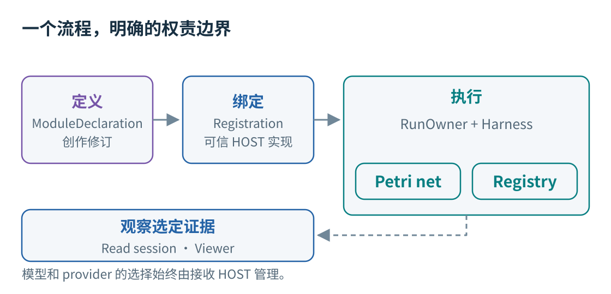
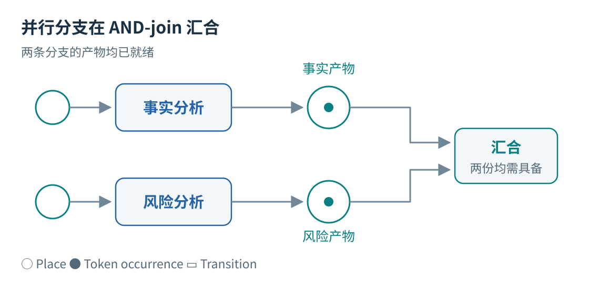
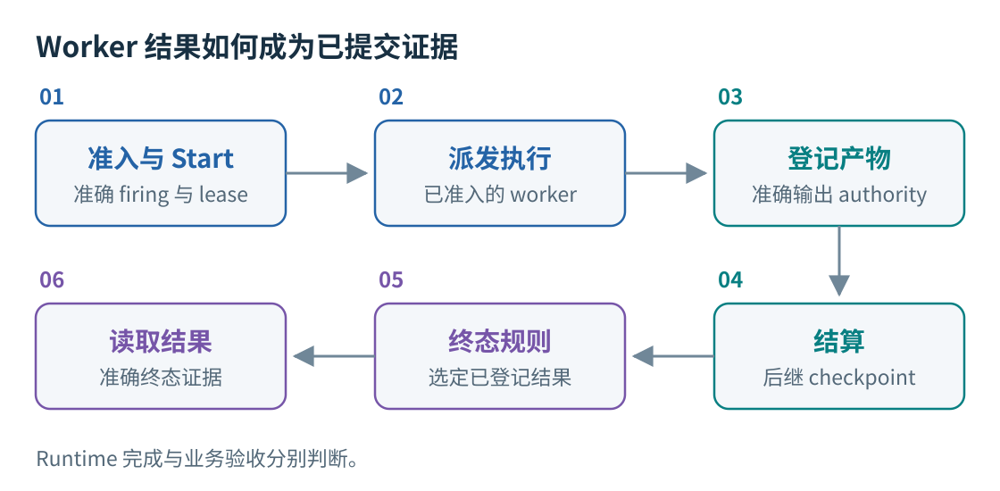
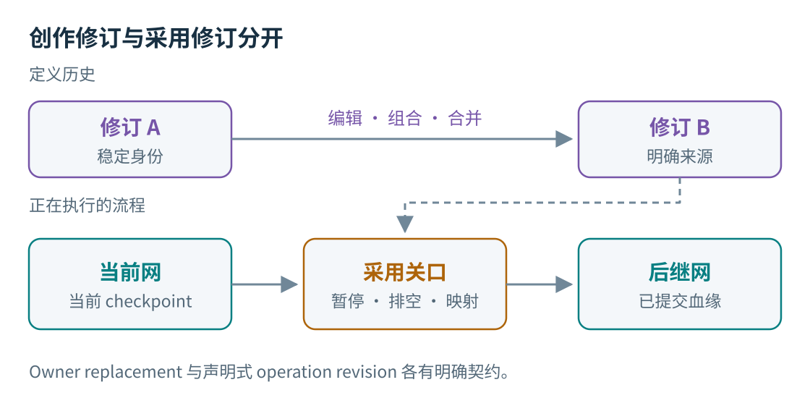
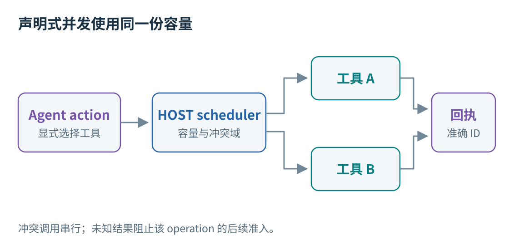
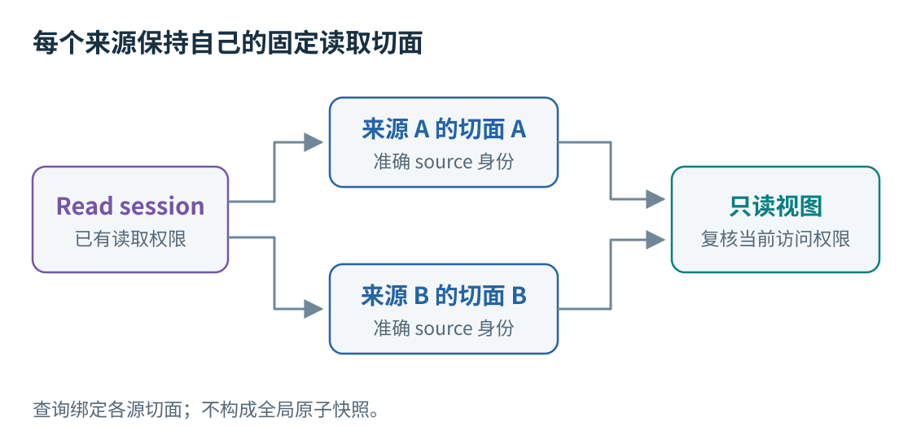
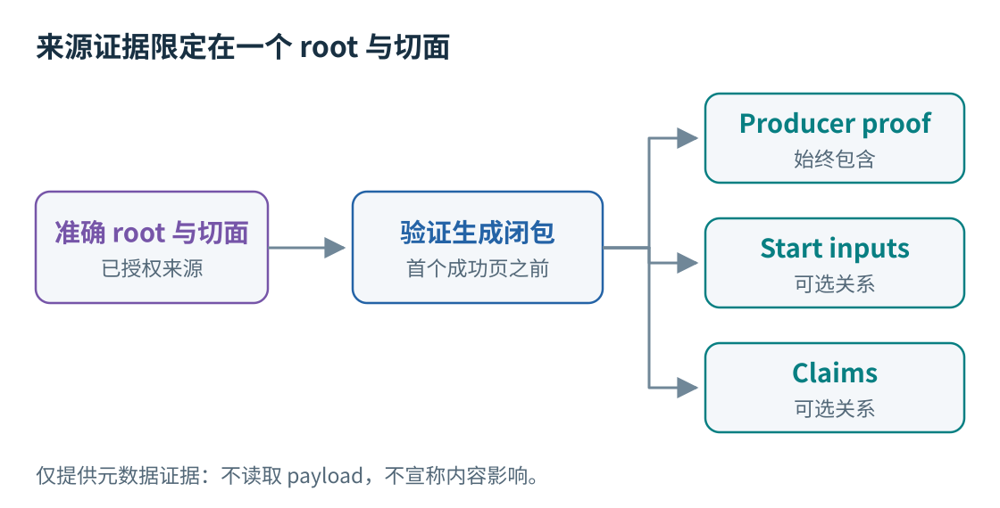
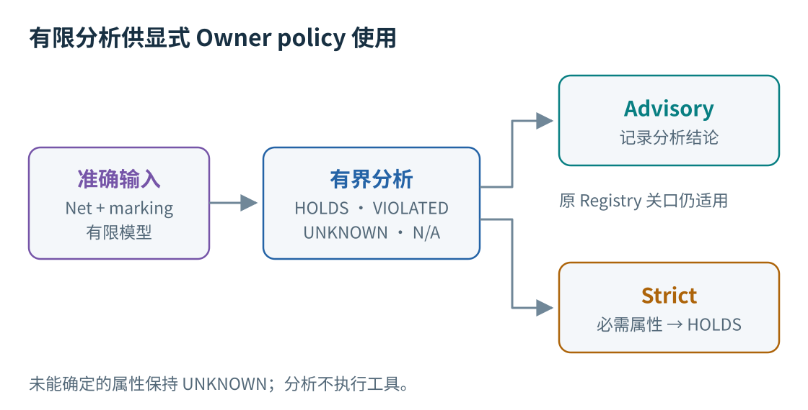

[English](technical-report.md) | 中文 | [文档导航](index_ZH.md)

# RPNH 技术报告

## 面向 Agent 与程序的可执行流程

**更新日期：**2026-10-10。**实现快照：**
[`a6f242ea187fadcef81a8c1e95377fec616dc840`][snapshot]。
历史测试分别保留自己的源码身份，见[第 10 节](#10-历史结果及其限制)。
本次报告更新未运行 runtime、模型或 benchmark 实验。

RPNH 是用于组合语言模型 Agent、原生程序与可复用工作流的 provider-neutral harness。
类型化流程定义依赖和 outcome，可信 HOST 注册提供实现，Registry 与 Petri-net 状态共同约束执行。
定义可以修订和复用；准确的产物、checkpoint 与 source-qualified 读取则保留可供审查的历史。

以下八张图各解释一个边界。它们是概念示意，不是运行截图或完整 schema；完整契约以链接中的专题为准。
RPNH 适用于重视持久化输出、显式协作或受控流程变更的应用，也会增加声明和状态管理工作。
已公开结果尚未建立相对其他 harness 的质量、速度或成本优势。

## 1. 将方法与实际执行分开

**图 1。** 定义、可信绑定、执行证据和观察是四类相互关联的资产。箭头表示关系，不代表另一套执行引擎。

- **定义：**`ModuleDeclaration`、Agent graph source 与不可变 author revision。
- **绑定：**`Registration` 将声明的 key 解析为可信 HOST 实现。声明不能自行引入可执行 Python locator；
  读取编译数据也不会注册 callable。
- **执行：**同一 `RunOwner`/`Harness` 路径负责准入与结算。`Orchestrator` 使用 HOST 已有的 owner、
  event loop、worker 与 dispatch service。
- **观察：**选定的 Registry 投影和 read session 保持只读。

Basic、Codex 与 OpenCode 是同一直接主会话根的不同呈现，共享 lease 防止多个可写呈现竞争。
DSH 是受注册管理的 HOST 接入。独立子任务各自拥有 Registry、net 和 owner；从属 execution net
则与业务网共享 Registry，用于 workspace finalization 等执行机制。Author assembly 成员关系属于定义层。
已有独立子任务入口不等于完整的原生父子启动至父完成链；此快照尚未接通该父子 transport 的生产边界。
见[父子执行边界][parent-child]。

详见：[架构](architecture/design_ZH.md)、[runtime 契约](reference/runtime-registry_ZH.md)。
代码：[声明][module]、[注册][registration]、[编译器][compiler]、[Orchestrator][orchestrator]。

## 2. 执行资格来自真实 token 与 claim

**图 2。** `prepare -> (facts || risks) -> join` 的局部结构；两条分支均已结算，各自的输入
occurrence 已消费，两份输出 occurrence 使 join 获得执行资格。图中省略最终输出 place。

类型化 place、带权 arc、outcome 与资源 claim 决定 firing 是否有效。Consume、read、borrow、guard、
produce 和 return 模式各有契约。Place fusion 共享一个 place，不会为广播复制产物。

`Harness.schedule_ready` 重建当前 net 和 marking、安装活动 claim，并遵守 in-flight 容量。
外部 selector 只能选择 enabled transition 的无重复子集。Worker 提交前先记录 Start；
调度偏好不能使原本无效的 firing 获得执行资格。

`AgentWorkflowGraph` 是便捷的依赖图接口；通用 `ModuleDeclaration` 支持更丰富的类型化契约。
Agent artifact label 用于路由文本产物，不证明业务数据有效。在当前 graph 边界，
native-plugin 节点只有一个输入和一个输出，且含此类节点的 graph 不支持 feedback。

详见：[声明](reference/declarations_ZH.md)、[工作流示例](../examples/workflow_patterns/README_ZH.md)。
代码：[Petri 契约][petri]、[Harness][harness]、[Agent graph][graph]。

## 3. Settlement 将计算连接到持久状态

**图 3。** 成功结果路径。等待、中断、执行阻塞和终态移交各有独立 disposition；并非每次 firing
结算都结束整个 run。

Future 返回本身不够。Owner 核对准确的 firing、Start 和 execution lease，再以已登记产物支持
outcome、后继 marking/checkpoint、适用的 workspace 发布及从属 execution 映射的结算。
当前 batch 契约每个事务至多包含一次 firing settlement/publication。持久化的已完成产物优先于竞态中的
stop，避免重放已经完成的语义操作。

`TaskControl.result` 沿当前 execution generation、终态证据与选定登记资源读取结果。
Status 和 result 使用同一个受保护的 `RunReadCut`，返回前再次核对。文件名、进程退出或最后一条
assistant 消息都不能替代结果选择依据。

Workspace 变化保留准确的 before/after 资源和版本血缘，并发变更保留冲突。
`resume` 继续最近一次 owner-stopped 切面；显式 `reopen` 创建新的 execution generation，保留后续历史。
Workspace recovery 不会撤销外部消息或交易。未知 provider submission 和 managed outcome 不能被当作
可以安全重试。ERP adapter 的未知结果回执提供脚本级防重放控制，不保证 ERP transaction 恰好执行一次。

详见：[checkpoint recovery](guides/checkpoint-recovery_ZH.md)、[ERP 生命周期](../examples/erp_bench/README_ZH.md#动作边界与生命周期)。
代码：[owner][owner]、[发布关口][commit]、[run reader][run-reader]、[TaskControl][task-control]。

## 4. 先创作修订，再显式采用

**图 4。** 定义历史与运行状态通过不同操作推进。图中采用流程表示 owner-driven replacement。

Extract、Compose、Instantiate 和 Branch 可以产生已登记的 `rpnh/module_declaration/v1` 资源。
Author API 提供稳定元素身份、expected-head 检查、来源映射、merge analysis 与 selected-change 历史。
Assembly 固定准确的成员修订与 lowering 映射；名称相同不足以证明身份相同。

运行时变更有两条显式路径：

1. **Owner replacement：**针对当前 net 准备候选，暂停准入、排空活动 firing，检查 occurrence
   mapping/retirement，再沿用已有预算与 workspace 血缘采用后继网。
2. **声明式 operation revision：**登记的 Module 产物与 `DeclaredModuleRevision` 提供经检查的
   structural delta 和有限 activation。Revision witness、后继 checkpoint 与 adoption 随 settlement
   闭合；切换整张网要求当前 firing 是唯一尚未解决的 provisional firing。

两条路径都不克隆 in-flight 模型调用，也不对正在执行的流程进行无限制语义合并。
[第 8 节](#8-有限-pn-分析具有显式-policy-边界)的 finite policy 适用于其文档规定的 owner-adoption 边界。

详见：[net operations](guides/net-operations_ZH.md)、[graph authoring](reference/graph-authoring_ZH.md)、
[身份变换](reference/author-identity-transform-contract_ZH.md)、[assembly](reference/assembly-full-history-merge_ZH.md)。
代码：[author API][authors]、[operation revision][revision]。

## 5. 在已声明的执行边界组合工具

**图 5。** Agent 执行内部的 managed-call 并发。这些调用不会自动成为独立的业务网 transition。

Native plugin 可以作为正式工作流节点，也可以作为 Agent 内部显式绑定的 managed tool。
[原子工具 pipeline](../examples/tool_pipeline/README_ZH.md)使用前一种边界：十个 transition
各自为 one-step executor 绑定一个可信 HOST 工具。检查、归一化和 AND-join 属于工作流结构，
各自拥有独立的准入 firing 与登记产物。

Managed scheduling 需显式选择。Pure policy 支持有界 pure call；conflict-domain policy
将冲突读写串行化，允许不相关 domain 并发。缺失或未知的冲突声明形成独占屏障。容量由整个 run 共享。
混合 builtin/managed turn 仍按原顺序执行；stop 阻止新启动并排空已准入的并行调用。
未知结果阻止该 operation 的新调用，等待经授权的 reconciliation。
真实回执与 whole-turn settlement 保留准确身份，不因完成先后而改变。

可选 Linux isolated program API 通过 HOST broker 组合显式选定的 managed call。
SDK 为同步接口（`tools.call`、`tools.parallel`、`tools.read_result`、`result`）；不支持隔离时
不会回退为不受限执行。程序不获得 HOST 文件、凭据、网络或 Registry writer。
Native plugin 自身则是可信 HOST 代码。

准确的输出 reader 对已登记结果分页，不会重新执行。返回结果、进入后续已提交请求、观测到业务状态变化
和模型在语义上使用结果是不同结论。没有显式 policy 时保留原有串行与 toolkit 行为。

详见：[受控 managed tools](controlled-managed-tools.zh.md)、[定制](guides/customization_ZH.md)。
代码：[scheduler][scheduler]、[program broker][broker]、[隔离 runtime][isolation]、[pipeline 声明][pipeline-module]。

## 6. 在各来源的独立切面只读观察

**图 6。** 每个来源内部的一致性不构成全局原子快照。离线或未获授权的来源保留明确缺口，不能当作零计数。

独立 read HOST 打开已有 Registry，不启动 task、不获取 writer fence，也不记录 Observation。
Owner 必须已经签发选定的 observer profile 与 grant。能访问目录、属于 SourceSet 或拥有 HOST 标签都不等于授权。
Index、record、material 与 export scope 分别控制。

类型化查询返回 source-qualified 引用和获准字段。Opaque session-local cursor 绑定完整查询、
source cut、权限、binding 与 reader/schema catalog；普通 append 不会移动已有切面。
交付前复核当前权限；撤销、binding/catalog 变化或过期会使相关数据和 cursor 失效。
比较所需的任一方失效时，清除整个比较对。Material 读取是单独的有界操作。

本地 Viewer 只投影选定 Registry 事实与 checkpoint 历史，不成为 writer。
SourceSet 原有的显式 query/record API 可以沿原发布契约持久化选定 observation；
普通 read-session 分页不写入，其 `capture_observation` 不受支持。
这些由本地 owner 控制的接口不建立远程信任，也不隔离同一 OS 用户下相互敌对的进程。

详见：[独立 reader](guides/independent-registry-reader_ZH.md)、[read-session 契约](reference/registry-read-sessions_ZH.md)、
[SourceSet observation](guides/source-queries_ZH.md)、[跨网比较](guides/comparison-context_ZH.md)。
代码：[read session][read-session]、[read-host 配置][read-host]。

## 7. 提出一个有界的产物来源问题

**图 7。** `product_origin_v1` 返回有限的元数据证据，不提供递归血缘，也不证明模型读取或使用了内容。

此快照中的 `query_product_origin_v1` 是 `cpn.rpnh.collaboration` 的公开 Python session method
及 convenience function。此快照没有安装态 origin-query CLI；comparison viewer 的 HTTP endpoint 也未提供此查询。
输入必须是由 Invocation 产生、准确 source-qualified 的 canonical `petri_output`/`workspace_write`
资源，或准确的 `operation_result/v1`，并提供同一 session 签发、同来源且未修改的 `SourceCut`。
名称、路径、`latest` 和跨来源搜索都不是受支持的 root。

查询始终验证 `producer_execution`，可选关系为 `start_inputs` 和 `claims`。
所需 record/index field 先经过预授权；首个成功页之前，验证生成闭包与全部所选关系的候选项和端点。
后续无效项不能藏在已经返回的成功前缀之后。序列化后再次核对当前访问权限。

- `root_role` 区分正式的 `registered_output` 成员、`invocation_produced_resource` 和
  `operation_result` root。仅有相同 producer 链接不足以成立。
- Start 行保留实际输入版本、次序与重复资源。Claim 区分 consumed 与 non-consuming；
  其资源引用可能不同于经替换后的 Start input。不读取正文。
- `complete` 只覆盖该授权 root、切面和所选关系。递归祖先、实际读取、工具调用因果和内容影响
  均不在此 profile 内；changed-net settlement 不受支持。

继续分页时重传不变的完整请求和返回的 cursor。默认每页 20，受 session 限制；
上限为 100 或 session 更小的限制。验证工作、保留状态和响应字节分别有界。
该 profile 的 content schema 是惰性验证数据。

详见：[产物来源契约](reference/registry-read-sessions_ZH.md)。
代码：[查询与分页][origin-query]、[producer proof][origin-core]、[关系验证][origin-includes]。

## 8. 有限 PN 分析具有显式 policy 边界

**图 8。** 显式选择且绑定输入的分析。分析报告和 policy 都不授予执行、settlement 或终态 authority。

`cpn.rpnh.pn_validation` 针对固定编译声明、准确 marking 与有限 modeled outcome 探索，
使用 production reservation/deposit 语义，但不执行工具或模型。
不同属性分别返回 `HOLDS`、`VIOLATED`、`UNKNOWN` 或 `NOT_APPLICABLE`。
Safety、proper completion、possible success、每个状态均可到达 allowed completion，
以及无 fairness 假设的 inevitable completion 不可混为一谈；允许的失败终态也不同于成功。

`start_run(..., pn_validation=...)` 在真实 owner 输入建立后、首次准入前登记显式模型、契约与 policy。
Advisory 记录结论并保留 Registry 原关口；strict 要求所有指定必需属性为 `HOLDS`，
缺失模型、不支持的必需属性，或使必需属性仍未确定的探索截断都会阻断。Policy 在 reopen 与文档规定的 owner adoption
路径中保留；adoption 在 commit 边界核对准确输入、映射与有界报告。

支持范围是有限的：不含内容的控制输出、声明的 outcome 及支持的 consume/read/lease/guard 形式。
未建模数据、动态网、外部回复/timeout、fairness 和本地 Agent progress obligation 保持 `UNKNOWN`。
HOST 忠实执行模型是假设。分析保留准确状态身份，探索截断不会被伪造为循环。
有限成功路径或反例可以在截断前建立其对应结论；全局 `HOLDS` 需要完整且受支持的探索。
Scheduler 模型是 `any-exact-binding`，不认证任意 scheduling callback。

详见：[有限 PN 验证](reference/pn-validation_ZH.md)。
代码：[分析契约][pn-contracts]、[owner policy][pn-policy]、[adoption gate][pn-adoption]。

## 9. 复用流程与选择示例

Portable package 携带受支持的定义、schema、资源与来源；接收方本地凭据、interpreter 路径、binding
和私有 run 证据独立保存。Preview/resolve 检查并锁定声明材料；environment planning 与明确批准的准备
先于单独批准的运行。V1/V2 package 支持单个 closed-module entry，更广的 author/assembly API
不会自动变成可移植格式。提供的 native wheel 通过有界 no-index/no-deps 接收路径安装。
Public metadata 不会自动清洗 package 内容。

Closed-author import 以 `copied_from` 来源和 expected-head 保护创建本地身份，不启动执行。
Workset 记录 contribution、delivery 与 acceptance；首次验收要求真实的已登记 operation output。
详见 [Workset 契约](reference/worksets_ZH.md)。

安装入口为 `rpnh`，用户自有的 provider/exact-model catalog 初始为空。
先看[安装指南](guides/installation_ZH.md)与[模型指南](guides/models_ZH.md)，再按需要检查的边界选例子：

- [Workflow patterns](../examples/workflow_patterns/README_ZH.md)：串行与并行依赖，默认使用脚本化本地响应。
- [Native plugin](../examples/native_plugin/README_ZH.md)：可修改的 schema 与显式安装的确定性程序。
- [Hybrid summary](../examples/hybrid_summary/README_ZH.md)：Agent → 程序 → Agent；默认脚本化，真实执行另行选择。
- [原子工具 pipeline](../examples/tool_pipeline/README_ZH.md)：离线用量/电价分支、金额计算、独立验证与最终发布。
- [Package reuse](../examples/package_reuse/README_ZH.md)：接收方绑定 closed process，准备与运行保持分离。

此快照的安装导出目录包含 `adapter_task`、`native_plugin`、`hybrid_summary`、`compose_serial`
和 `package_reuse`。`compose_serial` 只生成定义；导出不会安装或运行代码。
脚本化与原生示例仍需文档规定的 process/IPC 环境。源码为 `0.1.0rc2` 开发候选，
较早的 `v0.1.0rc1` 二进制具有更早的功能集。
详见[示例目录](guides/examples_ZH.md)与[package 指南](guides/portable-packages_ZH.md)。

## 10. 历史结果及其限制

以下是相互独立的历史窗口，不是对 `a6f242e` 或本次重写的验证。
[整理后的结果](results/README_ZH.md)保留完整 score/status 投影、输入、源码身份、命令和限制。
发布 commit 不等于重跑；runtime 完成不能替代原始业务验收。

### ERP-Bench

A04 与 H01 测试 clean tracked RPNH `6f8ee2e406f3c70edb73206f861e56a0202b9f15`，
使用 `local_process` 下的 `gpt-5.6-terra`，ERP-Bench task/scorer 为
`ceba3880af555129b5278e056a0c20f2fb5a0ba9`，首次发布在 `74fad32d…`。
适配环境为 Harbor 0.24.0、Odoo 19.0.20260926、Python 3.12.3 和 PostgreSQL 18.6；
solver 仅访问本地 Odoo，没有外部网络。

| 单次运行 | 原始业务结果 | 适用检查 | 真实调用 |
|---|---|---|---|
| A04，`2000_easy_01_buy_only_baseline` | 100/100 PASS | 37/37；1 NA | 9 |
| H01，`2299_hard_repair_plan_hard` | 21/100 FAIL | 86/95 | 13 |

H01 的九项失败包括四项 constraint 与五项 purchase-origin 检查。
原始计分 gate 将 63/75 constraint points 计为总体 21/100；86/95 是检查数量。
Checker exception 使单一原因归因不成立。更早 A01 被阻塞，A02 没有可评估的 quiescent world，
A03 为 0/100、11 次真实调用。Unknown 计数不是零。这些不同任务不是匹配比较或任务集成功率估计。
依赖请求内容的 input-reader 诊断，以及缺少准确独立源码锁的 offline coverage 声明继续撤回。
[完整 ERP 记录](results/erp-first-wave-20261008/README_ZH.md)。

### SlopCodeBench

Adapted development-prefix `code_search` 运行使用与
`74fad32d369876841686d10d33361c016e3d3648` 匹配的安装 RPNH，runner/evaluator 为
`31ceea3add480edb33431e70475c4c70597e6b31`，problem source 为
`9cd9ca3a51c3d3e2a99d2488a25baf73a2204451`，模型为 `codex/gpt-5.6-terra`。
结果发布在 `dbad0045…`。开发时查看过公开任务，不属于 held-out 评估。

| Checkpoint | 原始 evaluator | Runtime | 真实调用 |
|---|---|---|---|
| 1 | 13/13；exit 0 | complete | 5 |
| 2 | 25/25；exit 0 | complete | 5 |
| 3 | 40/47；exit 1 | complete | 14 |
| 4 与 5 | 未运行 | 未运行 | 未运行 |

Checkpoint 3 有七项失败，包括两项 Core 与五项 Functionality，25 项 regression 全部通过，
`infrastructure_failure=false`。分母包含 regression，不能相加当作独立任务数。
总计 24 次调用，零超限调用，998.82 秒；每个 checkpoint 上限为 48 次调用和 7,200 秒 owner 等待。
Upstream cost/net-cost/step cap 被禁用，标准化 task token 与 USD 成本未提供。

Solver 无网络，每个 checkpoint 使用新容器，由外部 controller 传递源码 snapshot
（`native_workspace_reuse=false`）。Build/evaluation 使用 HOST 网络和同版本下载兼容适配。
原 evaluator 已运行；official `AgentRunner`、完整五 checkpoint 与 quality judging 未运行。
没有 grader-feedback 修复、retry 或 resume。`any-case` 允许 checkpoint 3 失败时 outer exit 仍为 0。
更早的 synthetic 失败和原生阻塞尝试继续保留在[完整 SCB 记录](results/scb-prefix3-20261008/README_ZH.md)。

### 确定性 pipeline 与局部 runtime 窗口

- **原子工具 pipeline：**测试 `00f2d29c…` 加 16 个 example 文件，core 不变，后发布于 `80a17c3c…`。
  使用真实 AF_UNIX owner；32 个唯一 pytest ID、33 次执行，包含 unit check。
  标准 fixture 为 complete、**2.000 kWh / 1.70 CNY**、十次 firing、12 个工具产物和两个 source resource；
  rounding fixture 为 **0.02 CNY**。独立整数输入 validator 是示例 scorer，不是 benchmark grader。
  新进程 readback 保持 event ordinal/count 1001 与十次 dispatch/Start 不变，模型调用为零。
  更早 AF_UNIX 阻塞尝试单独保留。[准确来源、输入与结果](results/tool-pipeline-20261008/README_ZH.md)。
- **ERP runtime：**测试 `dbad004…` 加后来发布于 `e92b05c…` 的 overlay。
  65 个唯一 offline case 加四个 subtest，installed-owner complete/stop/timeout 路径与六个 direct-owner
  receipt 场景。九次 synthetic backend invocation 与后续 18 次 unknown-outcome probe 保持规定的防重放边界。
  没有真实 provider、Odoo world 或原 grader；重建复用同一个 owner，不能认证 OS-owner crash recovery。
  [完整窗口](results/erp-runtime-20261008/README_ZH.md)。
- **共享入口与准确 reader：**H1 测试 `674252f…` 加七个文件，通过 39 个唯一 native case。
  H1+H2a 测试 `715468d…` 加五个 reader 文件，后发布于 `d92ff37…`：八个窗口共 166 个唯一 case/执行，
  含 12 个独立 package check。真实 AF_UNIX/SIGINT/resume 使用脚本化 Agent，没有真实 provider。
  Pipeline/readback 的 11 个稳定字段一致，live-only transport/stop 字段缺席。
  更早 blocked 与 baseline-failure 窗口仍作为历史保留。这些是局部检查，不是整体产品验收。
  [完整源码与状态记录](results/entry-reader-20261009/README_ZH.md)。

带日期的 [AutomationBench 记录](../examples/automationbench/PUBLIC_RESULTS_20261006.md)保留
freeze04 first18 的 **5 PASS / 9 FAIL / 4 BLOCKED**，以及单独 repair4 条件的 **1 PASS / 3 FAIL**；
更早 14 个 scored task 没有重跑。[产品组合记录](results/product-validation-20261009/README_ZH.md)
保留独立 source identity、分窗口验证和原始失败，包括延期的 parity case 与不完整的 native/stock-client 范围。
它不认证后来的 PN 或 origin-query commit。本次更新没有重跑以上任何窗口。
其余版本特定检查见[release-validation 历史](guides/release-validation_ZH.md)。

## 源码索引

以下实现链接固定到本报告快照。历史结果页面分别标明不同的测试与发布版本。
API 细节见各图旁边的专题链接。
[snapshot]: https://github.com/Deng-0119/RPNH/tree/a6f242ea187fadcef81a8c1e95377fec616dc840
[module]: https://github.com/Deng-0119/RPNH/blob/a6f242ea187fadcef81a8c1e95377fec616dc840/cpn/rpnh/module.py
[registration]: https://github.com/Deng-0119/RPNH/blob/a6f242ea187fadcef81a8c1e95377fec616dc840/cpn/rpnh/registration.py
[compiler]: https://github.com/Deng-0119/RPNH/blob/a6f242ea187fadcef81a8c1e95377fec616dc840/cpn/rpnh/compiler.py
[orchestrator]: https://github.com/Deng-0119/RPNH/blob/a6f242ea187fadcef81a8c1e95377fec616dc840/cpn/orchestrator/runner.py
[petri]: https://github.com/Deng-0119/RPNH/blob/a6f242ea187fadcef81a8c1e95377fec616dc840/cpn/rpnh/petri_contracts.py
[harness]: https://github.com/Deng-0119/RPNH/blob/a6f242ea187fadcef81a8c1e95377fec616dc840/cpn/rpnh/harness.py
[graph]: https://github.com/Deng-0119/RPNH/blob/a6f242ea187fadcef81a8c1e95377fec616dc840/cpn/rpnh/agent_workflows.py
[owner]: https://github.com/Deng-0119/RPNH/blob/a6f242ea187fadcef81a8c1e95377fec616dc840/cpn/rpnh/run.py
[commit]: https://github.com/Deng-0119/RPNH/blob/a6f242ea187fadcef81a8c1e95377fec616dc840/cpn/rpnh/registry/_event_store/commit.py
[run-reader]: https://github.com/Deng-0119/RPNH/blob/a6f242ea187fadcef81a8c1e95377fec616dc840/cpn/rpnh/registry/run_authority.py
[task-control]: https://github.com/Deng-0119/RPNH/blob/a6f242ea187fadcef81a8c1e95377fec616dc840/cpn/rpnh/task_control.py
[authors]: https://github.com/Deng-0119/RPNH/blob/a6f242ea187fadcef81a8c1e95377fec616dc840/cpn/rpnh/collaboration/__init__.py
[revision]: https://github.com/Deng-0119/RPNH/blob/a6f242ea187fadcef81a8c1e95377fec616dc840/cpn/rpnh/registry/module_revision.py
[scheduler]: https://github.com/Deng-0119/RPNH/blob/a6f242ea187fadcef81a8c1e95377fec616dc840/cpn/plugins/managed_scheduler.py
[broker]: https://github.com/Deng-0119/RPNH/blob/a6f242ea187fadcef81a8c1e95377fec616dc840/cpn/components/agent_loop/program_execution.py
[isolation]: https://github.com/Deng-0119/RPNH/blob/a6f242ea187fadcef81a8c1e95377fec616dc840/cpn/plugins/controlled_script.py
[pipeline-module]: https://github.com/Deng-0119/RPNH/blob/a6f242ea187fadcef81a8c1e95377fec616dc840/examples/tool_pipeline/module.json
[read-session]: https://github.com/Deng-0119/RPNH/blob/a6f242ea187fadcef81a8c1e95377fec616dc840/cpn/rpnh/collaboration/registry_read_session.py
[read-host]: https://github.com/Deng-0119/RPNH/blob/a6f242ea187fadcef81a8c1e95377fec616dc840/cpn/rpnh/collaboration/read_host_config.py
[origin-query]: https://github.com/Deng-0119/RPNH/blob/a6f242ea187fadcef81a8c1e95377fec616dc840/cpn/rpnh/collaboration/_product_origin_query.py
[origin-core]: https://github.com/Deng-0119/RPNH/blob/a6f242ea187fadcef81a8c1e95377fec616dc840/cpn/rpnh/collaboration/_product_origin_core.py
[origin-includes]: https://github.com/Deng-0119/RPNH/blob/a6f242ea187fadcef81a8c1e95377fec616dc840/cpn/rpnh/collaboration/_product_origin_includes.py
[pn-contracts]: https://github.com/Deng-0119/RPNH/blob/a6f242ea187fadcef81a8c1e95377fec616dc840/cpn/rpnh/pn_validation/contracts.py
[pn-policy]: https://github.com/Deng-0119/RPNH/blob/a6f242ea187fadcef81a8c1e95377fec616dc840/cpn/rpnh/pn_validation/runtime_gate.py
[pn-adoption]: https://github.com/Deng-0119/RPNH/blob/a6f242ea187fadcef81a8c1e95377fec616dc840/cpn/rpnh/registry/pn_validation.py
[parent-child]: https://github.com/Deng-0119/RPNH/blob/a6f242ea187fadcef81a8c1e95377fec616dc840/cpn/rpnh/registry/parent_child.py
