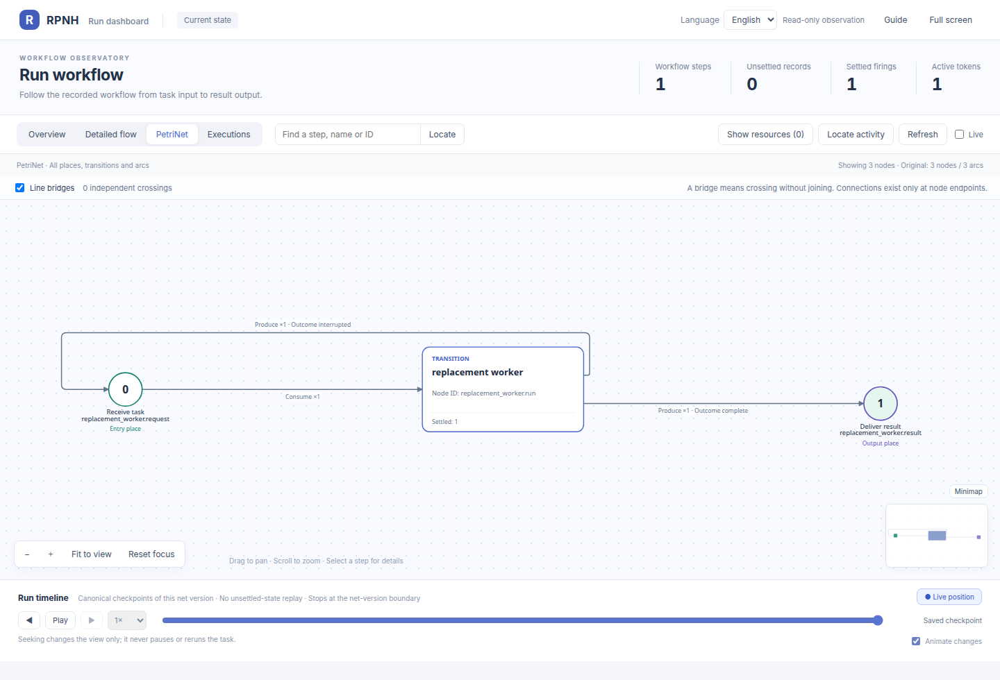

# RPNH 用户案例

[English](README.md) | 中文

若要把案例拿到自己的项目中，先看
[包含完整依赖的导出与修改教程](../docs/guides/examples_ZH.md#导出案例并改成自己的应用)。
命名导出包括 `native_plugin`、`hybrid_summary`、`compose_serial`、`package_reuse` 和默认
`adapter_task`；其余仍是源码案例。[v2 原生加法教程](../docs/guides/package-reuse-example_ZH.md)
会构建可分享包，并完整演示环境准备和真实执行。这些新导出需要本源码候选版构建的 wheel，
旧 rc1 wheel 不包含它们。AutomationBench 另有 Python 3.13+ 与固定上游的准备要求。

可以按希望观察的行为选择案例：

| 目标 | 案例 | 实际 dashboard | 默认模型边界 |
|---|---|---|---|
| 本地计算与登记资源 | [原生插件](native_plugin/README_ZH.md) |  | 不使用模型 |
| 串行模型—程序—模型计算 | [混合汇总](hybrid_summary/README_ZH.md) |  | 脚本替身；可传入精确真实 profile |
| 串行、并行、文档和长流程结构 | [工作流模式案例库](workflow_patterns/README_ZH.md) |  | 脚本替身；可传入精确真实 profile |
| 两个独立管理的子任务 | [任务工作区](task_workspace/README_ZH.md) |  | 脚本替身 |
| 定义操作与真实 replacement | [原生网操作](net_operations/README_ZH.md) |  | 纯定义操作加一个真实任务 |
| 通过全部支持宿主运行同一语义任务 | [安装版适配任务](../docs/guides/examples_ZH.md) |  | 用户自有精确真实 profile |
| 真实临床文档／数据 packet | [JB steering packet](jb_steering_packet/README_ZH.md) |  | 用户自有精确真实 profile |
| 真实数值最优控制任务 | [3-DOF 动力下降](three_dof_powered_descent/README_ZH.md) |  | 用户自有精确真实 profile |
| Office benchmark 接入与评分结果 | [HarnessAudit Office](harnessaudit_office/README_ZH.md) | 查看用户生成运行的命令；未归档截图 | 离线查看成绩；显式配置后执行／评分 |
| 独立 child run 驱动的 RRSI 两轮 Policy 演化 | [RRSI v0.6 application](rrsi_v06/README_ZH.md) | 查看用户生成 child Registry 的命令；未归档截图 | 用户自有精确真实 profile |
| 已保留业务 workflow benchmark 与宿主扩展 | [AutomationBench](automationbench/README_ZH.md) | 历史逐题成绩，以及 native/DSH acceptance 与冻结 cohort 工具 | 离线查看保留结果；新的实时运行需要已授权 profile |

每个可运行 workflow 都会创建真实 Registry，可用
`rpnh net --run RUN_DIR --view --no-open` 打开。脚本替身经过相同协议与结算边界，但不代表
模型推理能力。每张链接图片都来自对应类型的 run；公开副本移除了精确 checkpoint 身份和
本地观察时间。

中断／恢复行为请使用独立任务案例和专门的
[checkpoint 恢复指南](../docs/guides/checkpoint-recovery_ZH.md)。Reopen 会在同一 Registry
中追加新的执行代次，不会改写案例的最终成功图片或参考结果。

请从[完整案例指南](../docs/guides/examples_ZH.md)和
[看板指南](../docs/guides/viewer_ZH.md)开始。生成的 profile、Registry 目录和 provider
transcript 均保存在仓库之外。

2026-10-06公开记录：freeze04首轮18题为5 PASS / 9 FAIL / 4 BLOCKED；独立repair四题为1 PASS / 3 FAIL。旧14道已评分题未重跑。 [结果与限制](automationbench/PUBLIC_RESULTS_20261006_ZH.md).
