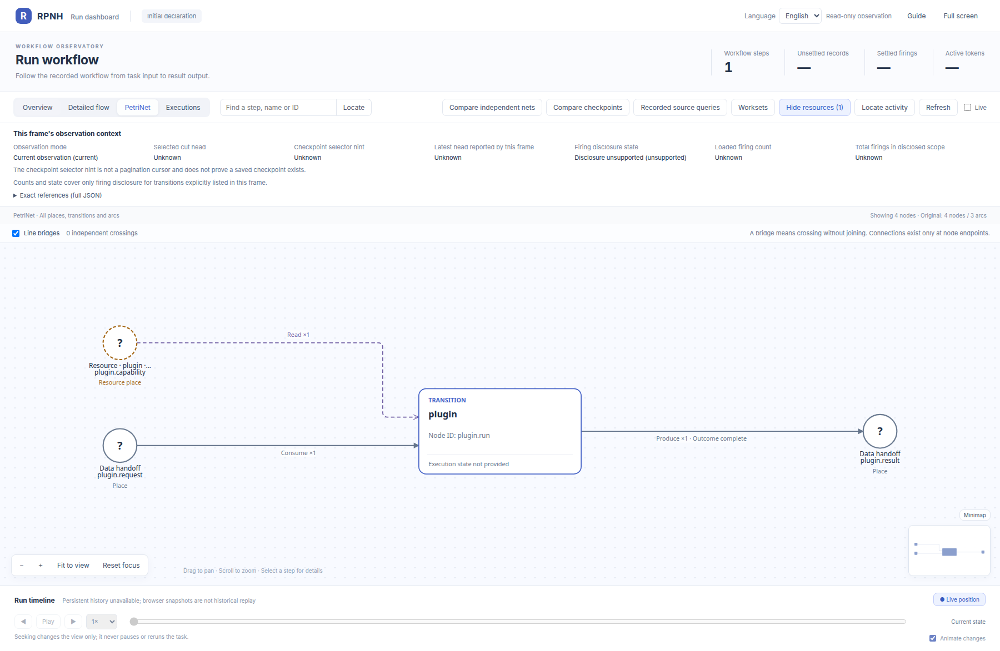

# native_plugin：PetriNet 声明图册

[English](README.md) | 中文

以下是[公开源码 `34d42d17`](https://github.com/Deng-0119/RPNH/tree/34d42d171d7e9a7f803b71467063b55786c2cea8)中声明的初始 PetriNet 结构，由官方 RPNH viewer 展示。圆形表示 place，矩形表示 transition，弧表示输入、输出或读取关系。大网下方附有可单独打开的节点局部图。

[返回案例说明](../README_ZH.md)。

## 两数相加

声明源码：[examples/native_plugin/rpnh_demo.py](https://github.com/Deng-0119/RPNH/blob/34d42d171d7e9a7f803b71467063b55786c2cea8/examples/native_plugin/rpnh_demo.py), [cpn/plugins/runtime.py](https://github.com/Deng-0119/RPNH/blob/34d42d171d7e9a7f803b71467063b55786c2cea8/cpn/plugins/runtime.py), [examples/native_plugin/input.json](https://github.com/Deng-0119/RPNH/blob/34d42d171d7e9a7f803b71467063b55786c2cea8/examples/native_plugin/input.json).

## 读取登记的指令资源

声明源码：[examples/native_plugin/rpnh_demo.py](https://github.com/Deng-0119/RPNH/blob/34d42d171d7e9a7f803b71467063b55786c2cea8/examples/native_plugin/rpnh_demo.py), [cpn/plugins/runtime.py](https://github.com/Deng-0119/RPNH/blob/34d42d171d7e9a7f803b71467063b55786c2cea8/cpn/plugins/runtime.py), [examples/native_plugin/instruction-input.json](https://github.com/Deng-0119/RPNH/blob/34d42d171d7e9a7f803b71467063b55786c2cea8/examples/native_plugin/instruction-input.json).

## 汇总有界整数

声明源码：[examples/native_plugin/rpnh_demo.py](https://github.com/Deng-0119/RPNH/blob/34d42d171d7e9a7f803b71467063b55786c2cea8/examples/native_plugin/rpnh_demo.py), [cpn/plugins/runtime.py](https://github.com/Deng-0119/RPNH/blob/34d42d171d7e9a7f803b71467063b55786c2cea8/cpn/plugins/runtime.py), [examples/native_plugin/summary-input.json](https://github.com/Deng-0119/RPNH/blob/34d42d171d7e9a7f803b71467063b55786c2cea8/examples/native_plugin/summary-input.json).

[图片身份记录](../results/figure-provenance.json)。
