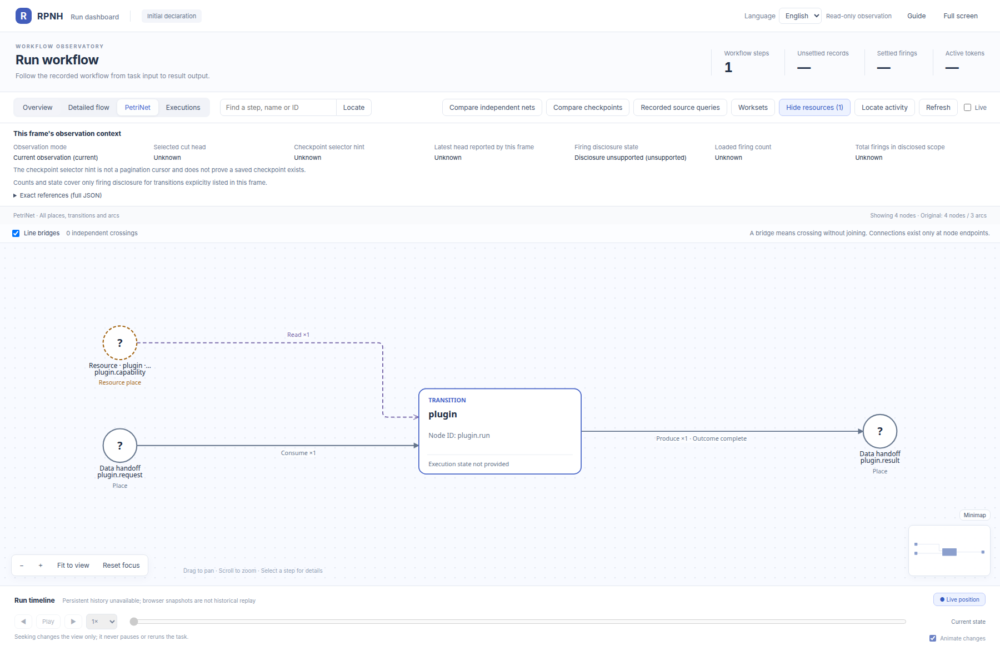

# package_reuse：PetriNet 声明图册

[English](README.md) | 中文

以下是[公开源码 `34d42d17`](https://github.com/Deng-0119/RPNH/tree/34d42d171d7e9a7f803b71467063b55786c2cea8)中声明的初始 PetriNet 结构，由官方 RPNH viewer 展示。圆形表示 place，矩形表示 transition，弧表示输入、输出或读取关系。大网下方附有可单独打开的节点局部图。

[返回案例说明](../README_ZH.md)。

## 复用的原生加法包

声明源码：[examples/package_reuse/README.md](../README.md), [examples/package_reuse/build_package.py](https://github.com/Deng-0119/RPNH/blob/34d42d171d7e9a7f803b71467063b55786c2cea8/examples/package_reuse/build_package.py), [examples/package_reuse/native-add-v2.lock.json](https://github.com/Deng-0119/RPNH/blob/34d42d171d7e9a7f803b71467063b55786c2cea8/examples/package_reuse/native-add-v2.lock.json).

[图片身份记录](../results/figure-provenance.json)。
