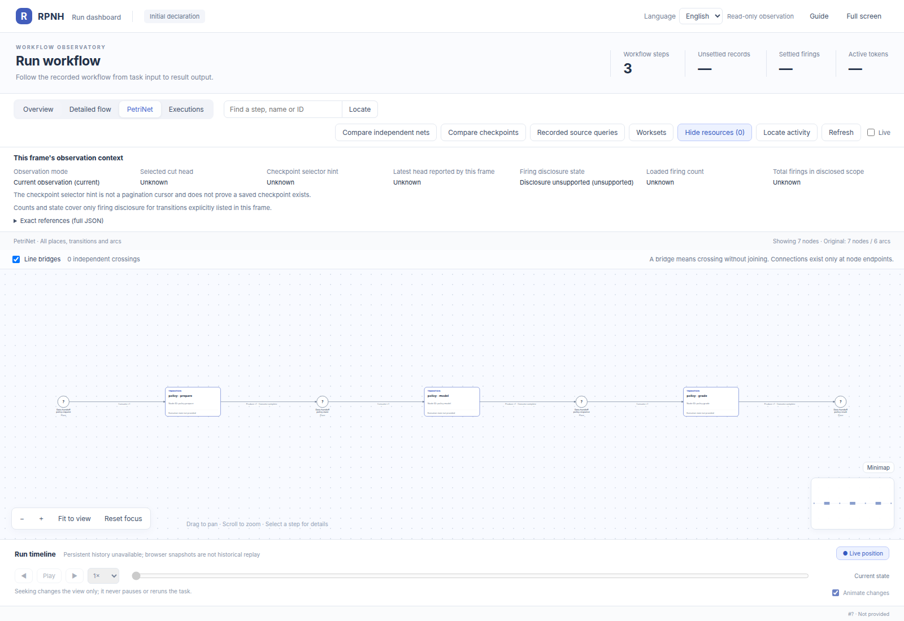
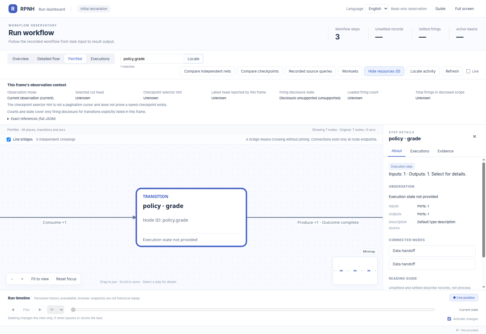
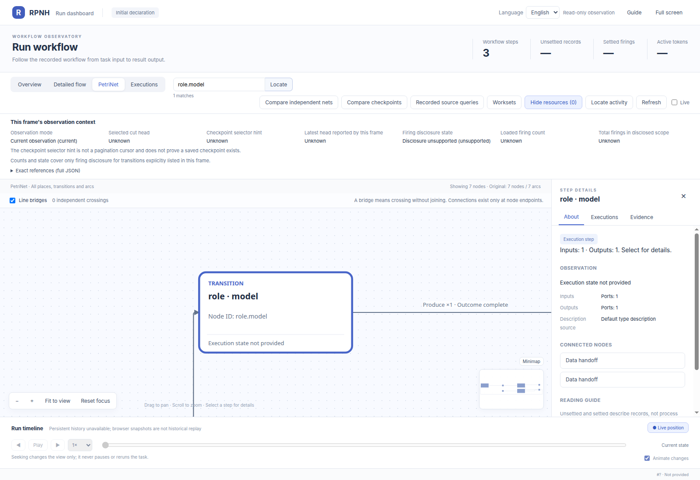
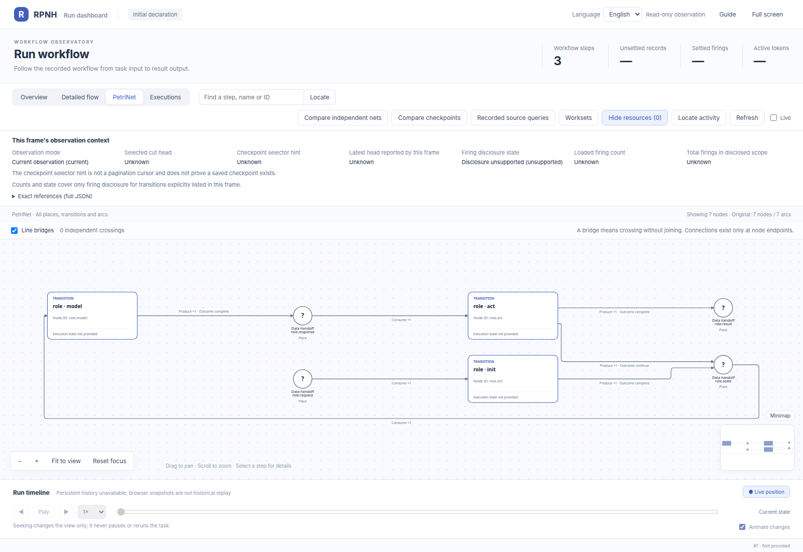
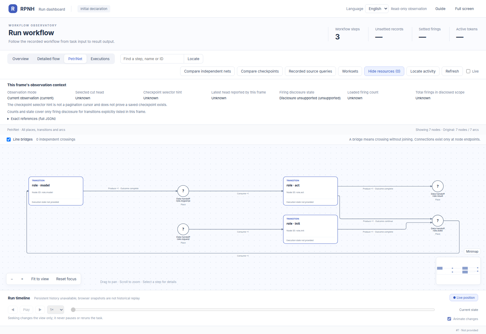
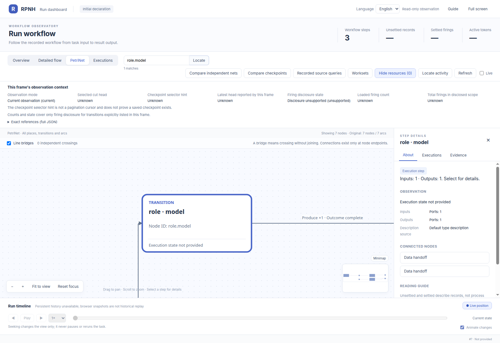

# RRSI v0.6 application example

English | [中文](README_ZH.md)

This example implements the public RRSI v0.6 method as a bounded application on
the existing RPNH Registry and PetriNet runtime. It demonstrates how the current
harness supports an RSI role loop, independent evaluations, and score/cost
selection. Analyst, Digester, Proposer, Critic, and Policy occurrences run as
independent RPNH child runs with their own Registry evidence. The user's
execution profile selects the provider and model.

The included timeout fixture exercises two rounds of Policy evolution. The
reference method and domain adapters are available at
[`google-research/rrsi`](https://github.com/google-research/rrsi). See
`DESIGN.md` for the application design and `THIRD_PARTY_NOTICES.md` for
attribution.

## PetriNet declarations

Each image below is the initial declaration of one independent child Module,
rendered by the RPNH PetriNet viewer. They show structure without a run, marking,
score, or success claim. The Policy and four role declarations are separate:
their full compiled documents differ, even where the displayed topology looks
alike. The [figure identities](results/figure-provenance.json) bind these images
to the public source and exact compiled/projection bytes.

The campaign coordinates calibration, two evolution rounds, heldout evaluation,
and export. Each scored slot instantiates Policy; each round instantiates
Analyst, Proposer, and Critic, and Analyst requests can create Digester children.
A campaign occurrence has its own Registry evidence. Reusing a declaration
figure does not share execution state between occurrences.

### Policy: prepare, model, grade



The request passes through prepare, one registered model operation, and the
independent grader before reaching result. The readable node details below are
views of the same PetriNet, with no changes to its structure.




### Analyst




### Proposer


### Critic




### Digester




Each role initializes state, invokes its registered model operation, and handles
the response. The action transition either returns to state for another model
step or publishes result. Role-specific tool declarations, limits, and bindings
remain distinct. The model details enlarge that operation; open each full image
to inspect the complete PetriNet at its original resolution.

## Install and test

From the RPNH source root:

```bash
python -m pip install -e .
python -m pip install -e './examples/rrsi_v06[test]'
python -m pytest examples/rrsi_v06/tests -q
```

The tests use scripted input ports and make no provider calls. The root RPNH
test discovery does not automatically include this standalone example; run the
explicit command above.

## Run with your profile

The following command can contact the model configured by your own RPNH
execution profile. Use it only after authorizing that experiment. Keep the run
directory and profile outside the repository.

```bash
: "${RPNH_EXECUTION_PROFILE:?Set an authorized RPNH execution profile}"
export RRSI_WORK="$(mktemp -d)"
python examples/rrsi_v06/example.py \
  --run-root "$RRSI_WORK/run" \
  --execution "$RPNH_EXECUTION_PROFILE" \
  --protocol examples/rrsi_v06/protocol.example.json
```

The destination must not already exist. The report is written to
`$RRSI_WORK/run/formal-report.json`; each child Registry remains under `roles/`
or `policy/`. For example, inspect one generated Policy run with:

```bash
rpnh net --run "$RRSI_WORK/run/policy/evolve-h0/H0/evolve-missing-0" \
  --view --no-open
```

Keep your execution profile and generated run artifacts outside the source
checkout. Inspect each experiment through its report and child Registries.

## Completion meaning

`formal_rrsi_v06_local_complete=true` records completion of the frozen timeout
fixture's planned rounds and Policy slots with Registry, PetriNet, and provider
evidence. Scripted tests use `injected_test_runners`; their structural result is
recorded in `execution_evidence.structural_campaign_complete`. Read
`round_decisions`, the H0/final evolve and heldout aggregates, and `usage` to
inspect adoption, scores, and token coverage.

## Partial reports, usage, and cooperative stop

Execution-control revision `rrsi_v06/execution_control/v2` keeps the frozen
protocol, prompts, scorer, selection formula, and B0 no-application-retry policy.
`formal-report.json` is atomically checkpointed before/after child execution.
`report_status` is `running`, `incomplete`, or `completed`; this describes report
execution, independently of `formal_rrsi_v06_local_complete`. An abort preserves
known child references, completed child results/evaluations, and observed input
attempts. `termination` records the stage and error class without exception text.
A failed child has no invented reward. The original exception is still raised.
If writing fails, the last valid snapshot may remain `running`; sanitized
secondary-error notes accompany the original exception. A killed process or
unavailable storage cannot guarantee a final report.

`usage.roles.input_port_invocations` / `usage.policy.input_port_invocations` counts calls to the neutral input port. The legacy
`physical_attempts` value remains a deprecated alias with explicit semantics;
it does not count adapter probes or recovery calls. `total_tokens` and the
existing method's `cost_comparable` cover visible final-response usage only.
`provider_physical_calls` and `provider_physical_total_tokens` remain unknown,
and `provider_physical_cost_complete` is false. Reconcile transport details with
the private adapter audit; never publish credentials or raw exception payloads.

Python callers can pass `interruption_requested=<callable>` to
`run_formal_campaign`, `run_policy_trial`, or `run_role_session`. The callback
reaches the existing Harness owner-stop and interruptible input-port boundary.
A legacy port can stop before submission but cannot promise in-flight
cancellation. The CLI does not install a new signal handler, and this revision
does not add resubmission, resume logic, or checkpoint routes. A caller should
use a cooperative stop callback for orderly cancellation. Standard interrupts
are recorded when they unwind through the report boundary.
