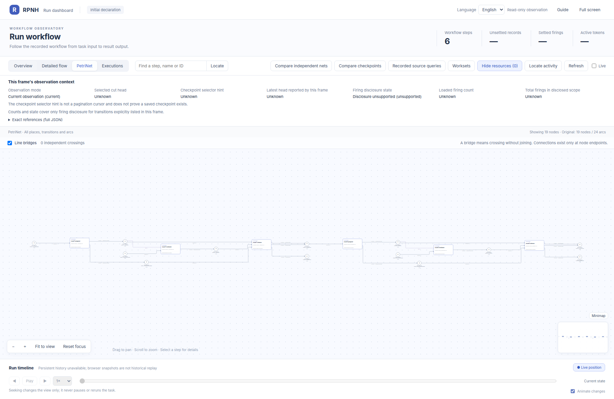
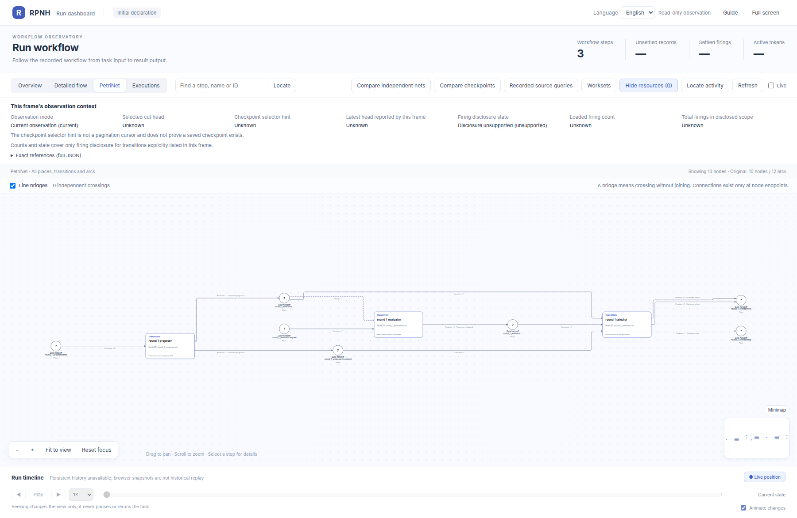

# rsi_workflows: PetriNet declaration gallery

English | [中文](README_ZH.md)

The official RPNH viewer shows the initial PetriNet structures declared in [public source `34d42d17`](https://github.com/Deng-0119/RPNH/tree/34d42d171d7e9a7f803b71467063b55786c2cea8). Circles are places, rectangles are transitions, and arcs show input, output or read relationships. Open the linked node-detail images to inspect large nets.

[Return to the example guide](../README.md).

## One-round synthetic iteration

Declaration source: [examples/rsi_workflows/deterministic.py](https://github.com/Deng-0119/RPNH/blob/34d42d171d7e9a7f803b71467063b55786c2cea8/examples/rsi_workflows/deterministic.py), [examples/rsi_workflows/tests/test_runtime.py](https://github.com/Deng-0119/RPNH/blob/34d42d171d7e9a7f803b71467063b55786c2cea8/examples/rsi_workflows/tests/test_runtime.py), [cpn/rpnh/iteration_profile.py](https://github.com/Deng-0119/RPNH/blob/34d42d171d7e9a7f803b71467063b55786c2cea8/cpn/rpnh/iteration_profile.py).

[Inspect all node details](nodes/rsi_rounds_1/README.md).

## Two-round synthetic iteration

Declaration source: [examples/rsi_workflows/deterministic.py](https://github.com/Deng-0119/RPNH/blob/34d42d171d7e9a7f803b71467063b55786c2cea8/examples/rsi_workflows/deterministic.py), [examples/rsi_workflows/tests/test_runtime.py](https://github.com/Deng-0119/RPNH/blob/34d42d171d7e9a7f803b71467063b55786c2cea8/examples/rsi_workflows/tests/test_runtime.py), [cpn/rpnh/iteration_profile.py](https://github.com/Deng-0119/RPNH/blob/34d42d171d7e9a7f803b71467063b55786c2cea8/cpn/rpnh/iteration_profile.py).

[Inspect all node details](nodes/rsi_rounds_2/README.md).

## Three-round synthetic iteration

Declaration source: [examples/rsi_workflows/deterministic.py](https://github.com/Deng-0119/RPNH/blob/34d42d171d7e9a7f803b71467063b55786c2cea8/examples/rsi_workflows/deterministic.py), [examples/rsi_workflows/tests/test_runtime.py](https://github.com/Deng-0119/RPNH/blob/34d42d171d7e9a7f803b71467063b55786c2cea8/examples/rsi_workflows/tests/test_runtime.py), [cpn/rpnh/iteration_profile.py](https://github.com/Deng-0119/RPNH/blob/34d42d171d7e9a7f803b71467063b55786c2cea8/cpn/rpnh/iteration_profile.py).

[Inspect all node details](nodes/rsi_rounds_3/README.md).

## Four-round synthetic iteration

Declaration source: [examples/rsi_workflows/deterministic.py](https://github.com/Deng-0119/RPNH/blob/34d42d171d7e9a7f803b71467063b55786c2cea8/examples/rsi_workflows/deterministic.py), [examples/rsi_workflows/tests/test_runtime.py](https://github.com/Deng-0119/RPNH/blob/34d42d171d7e9a7f803b71467063b55786c2cea8/examples/rsi_workflows/tests/test_runtime.py), [cpn/rpnh/iteration_profile.py](https://github.com/Deng-0119/RPNH/blob/34d42d171d7e9a7f803b71467063b55786c2cea8/cpn/rpnh/iteration_profile.py).

[Inspect all node details](nodes/rsi_rounds_4/README.md).

## One-round failed-retain terminal binding

Declaration source: [examples/rsi_workflows/deterministic.py](https://github.com/Deng-0119/RPNH/blob/34d42d171d7e9a7f803b71467063b55786c2cea8/examples/rsi_workflows/deterministic.py), [examples/rsi_workflows/tests/test_runtime.py](https://github.com/Deng-0119/RPNH/blob/34d42d171d7e9a7f803b71467063b55786c2cea8/examples/rsi_workflows/tests/test_runtime.py), [cpn/rpnh/iteration_profile.py](https://github.com/Deng-0119/RPNH/blob/34d42d171d7e9a7f803b71467063b55786c2cea8/cpn/rpnh/iteration_profile.py).

[Inspect all node details](nodes/rsi_one_round_failed_retain/README.md).
[Figure identities](../results/figure-provenance.json).
