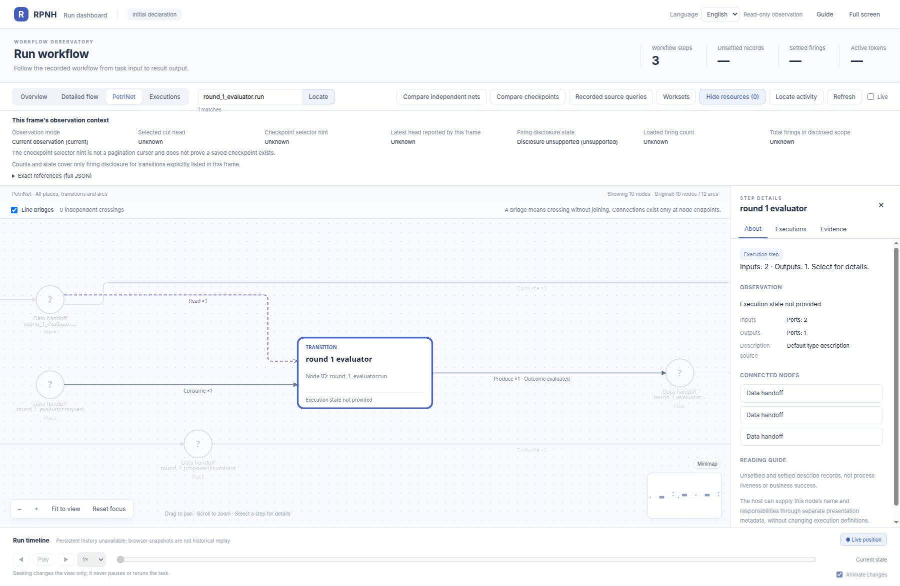
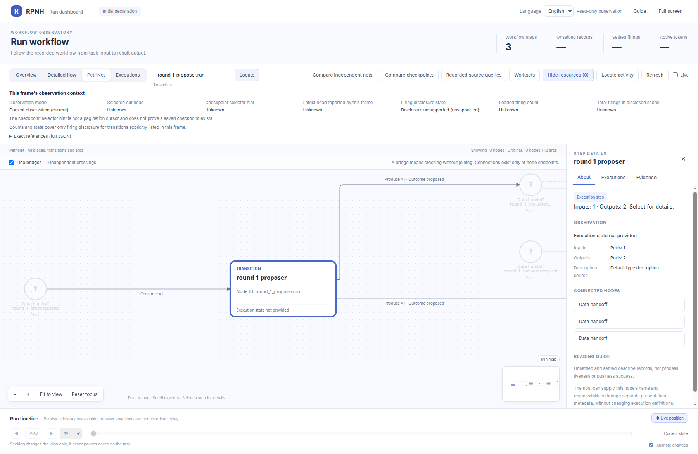
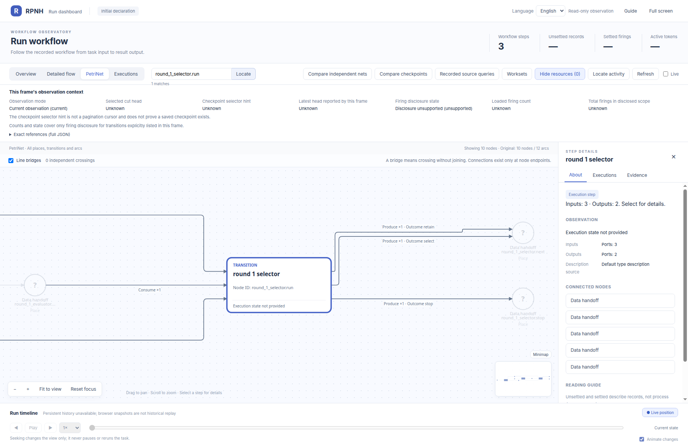

# rsi_rounds_1: node details

English | [中文](README_ZH.md)

Official-viewer close-ups of each transition in the same initial PetriNet.

[Return to the complete PN gallery](../../README.md).

## round_1_evaluator.run

## round_1_proposer.run

## round_1_selector.run

