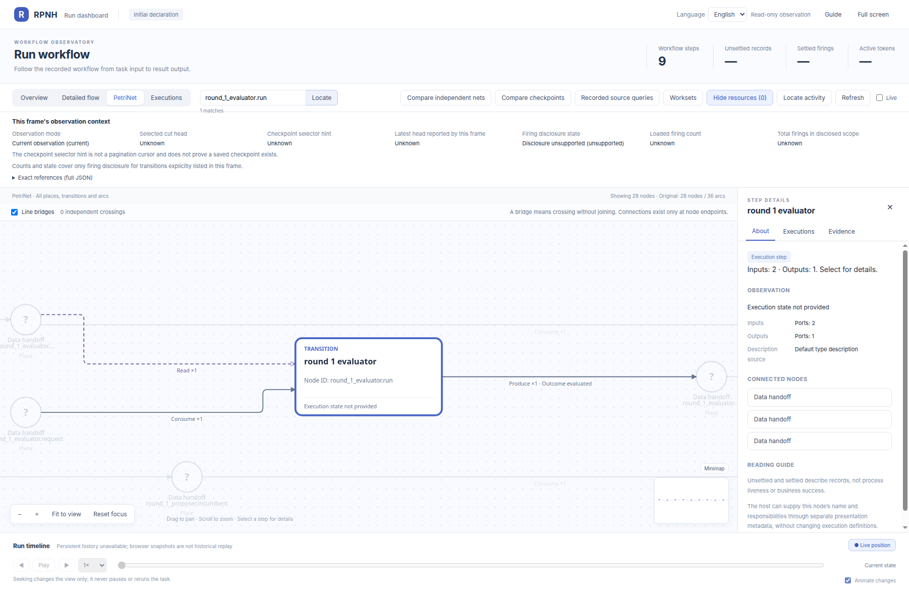
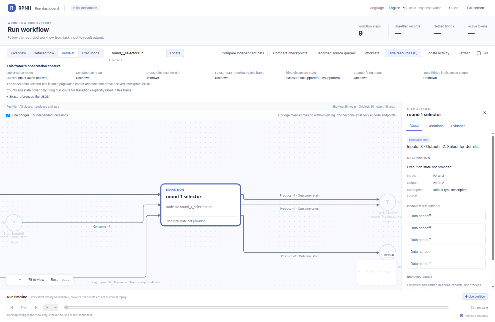
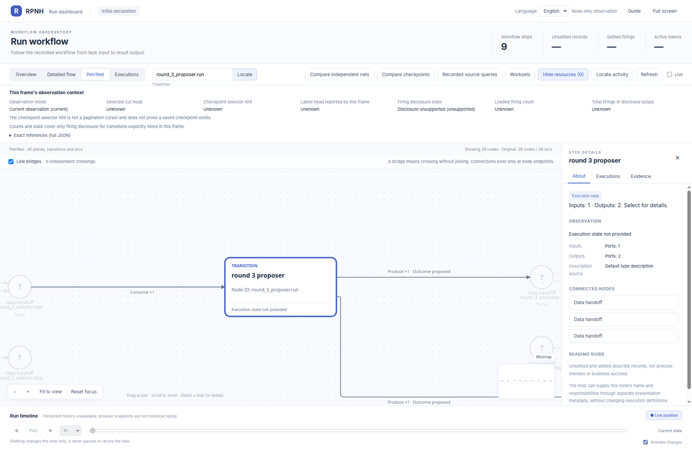

# rsi_rounds_3：节点细节

[English](README.md) | 中文

同一初始 PetriNet 中各 transition 的官方 viewer 放大视图。

[返回完整 PN 图册](../../README_ZH.md)。

## round_1_evaluator.run

## round_1_proposer.run

## round_1_selector.run

## round_2_evaluator.run

## round_2_proposer.run

## round_2_selector.run

## round_3_evaluator.run

## round_3_proposer.run

## round_3_selector.run

