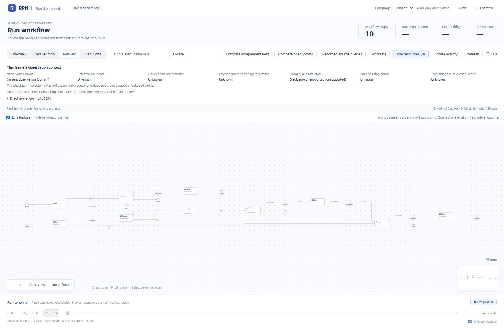

# tool_pipeline：PetriNet 声明图册

[English](README.md) | 中文

以下是[公开源码 `34d42d17`](https://github.com/Deng-0119/RPNH/tree/34d42d171d7e9a7f803b71467063b55786c2cea8)中声明的初始 PetriNet 结构，由官方 RPNH viewer 展示。圆形表示 place，矩形表示 transition，弧表示输入、输出或读取关系。大网下方附有可单独打开的节点局部图。

[返回案例说明](../README_ZH.md)。

## 十操作账单流水线

声明源码：[examples/tool_pipeline/README.md](../README.md), [examples/tool_pipeline/module.json](https://github.com/Deng-0119/RPNH/blob/34d42d171d7e9a7f803b71467063b55786c2cea8/examples/tool_pipeline/module.json), [examples/tool_pipeline/run.py](https://github.com/Deng-0119/RPNH/blob/34d42d171d7e9a7f803b71467063b55786c2cea8/examples/tool_pipeline/run.py), [examples/tool_pipeline/tests/test_pipeline.py](https://github.com/Deng-0119/RPNH/blob/34d42d171d7e9a7f803b71467063b55786c2cea8/examples/tool_pipeline/tests/test_pipeline.py).

[查看全部节点细节](nodes/tools_ten_operations/README_ZH.md).

## 用量拒绝夹具绑定

声明源码：[examples/tool_pipeline/README.md](../README.md), [examples/tool_pipeline/tests/test_pipeline.py](https://github.com/Deng-0119/RPNH/blob/34d42d171d7e9a7f803b71467063b55786c2cea8/examples/tool_pipeline/tests/test_pipeline.py).

[查看全部节点细节](nodes/tools_rejected_usage/README_ZH.md).

## 时间区间不匹配夹具绑定

声明源码：[examples/tool_pipeline/README.md](../README.md), [examples/tool_pipeline/tests/test_pipeline.py](https://github.com/Deng-0119/RPNH/blob/34d42d171d7e9a7f803b71467063b55786c2cea8/examples/tool_pipeline/tests/test_pipeline.py).

[查看全部节点细节](nodes/tools_mismatched_intervals/README_ZH.md).

## 双分支拒绝夹具绑定

声明源码：[examples/tool_pipeline/README.md](../README.md), [examples/tool_pipeline/tests/test_pipeline.py](https://github.com/Deng-0119/RPNH/blob/34d42d171d7e9a7f803b71467063b55786c2cea8/examples/tool_pipeline/tests/test_pipeline.py).

[查看全部节点细节](nodes/tools_double_rejection/README_ZH.md).
[图片身份记录](../results/figure-provenance.json)。
