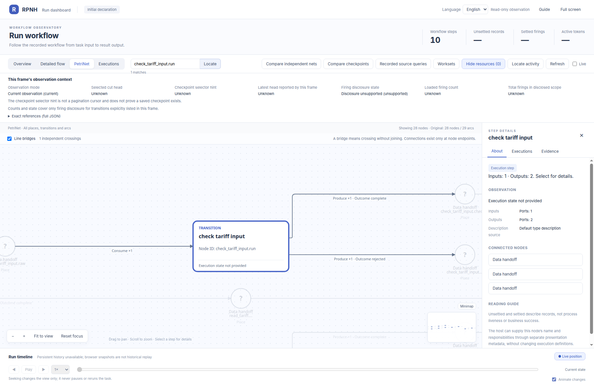
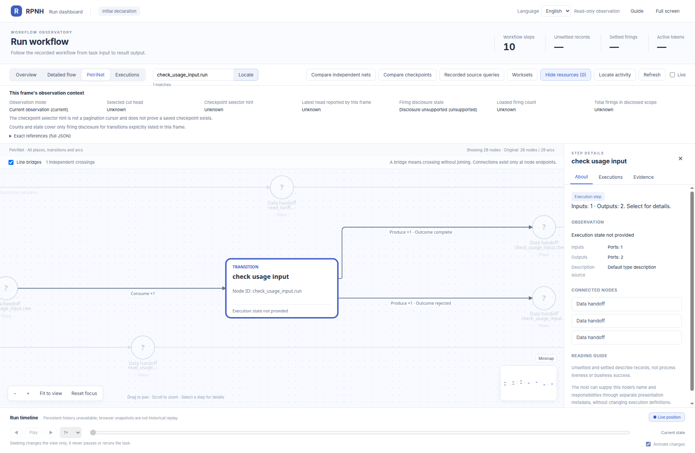
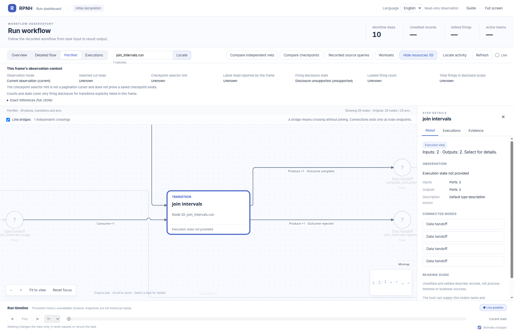
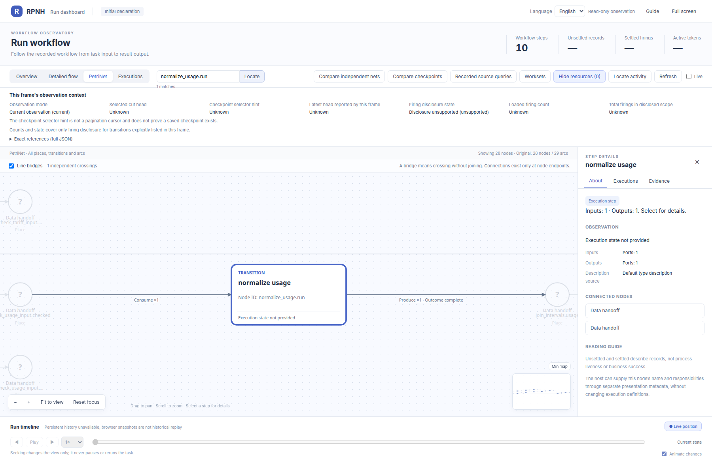
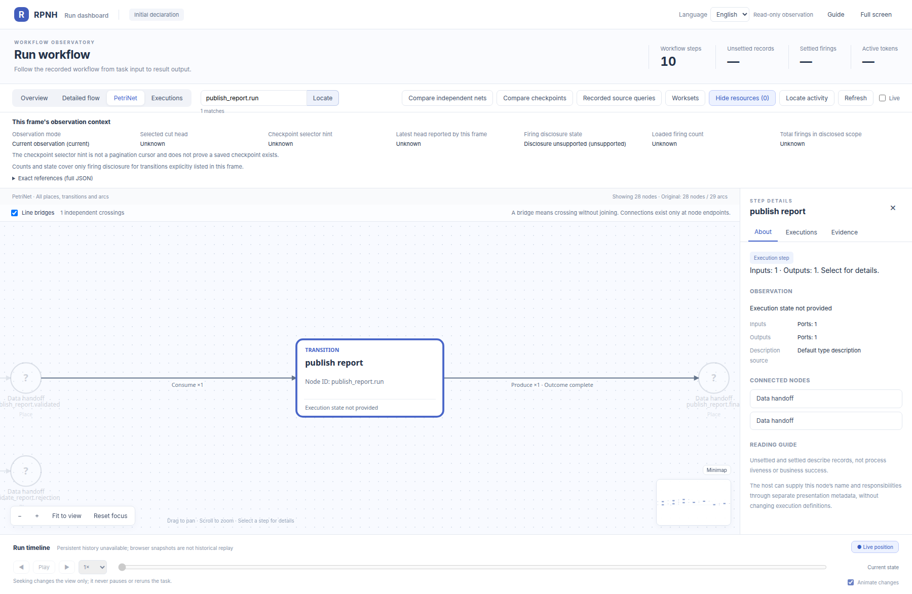
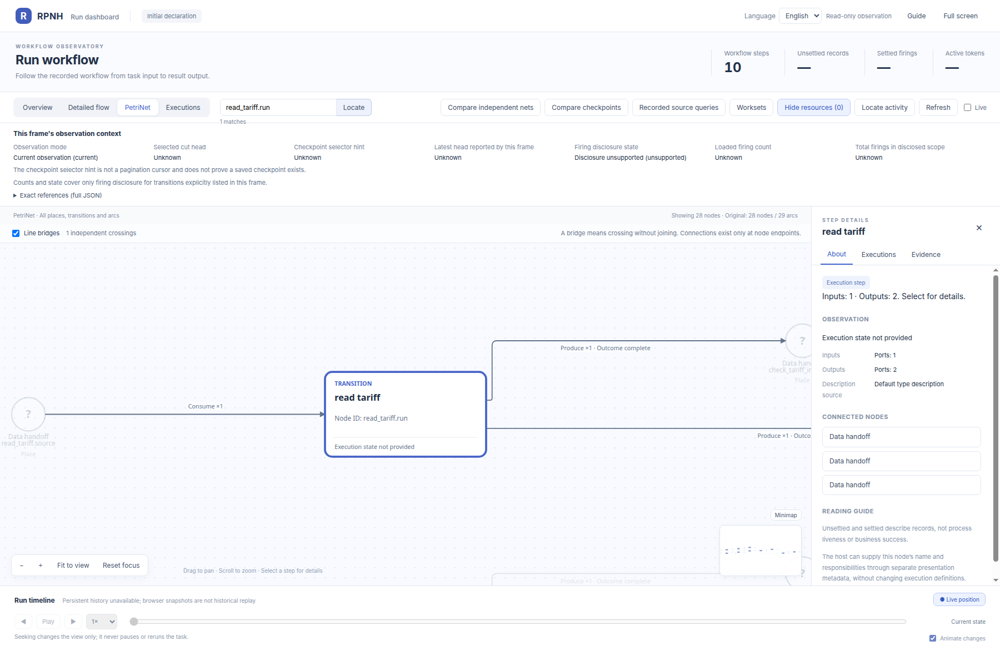
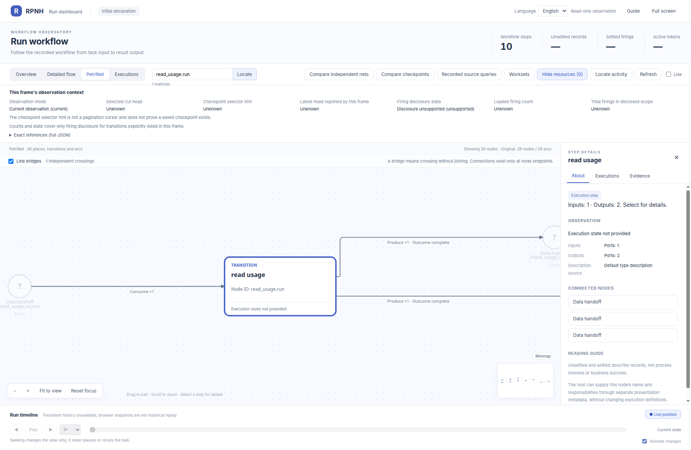
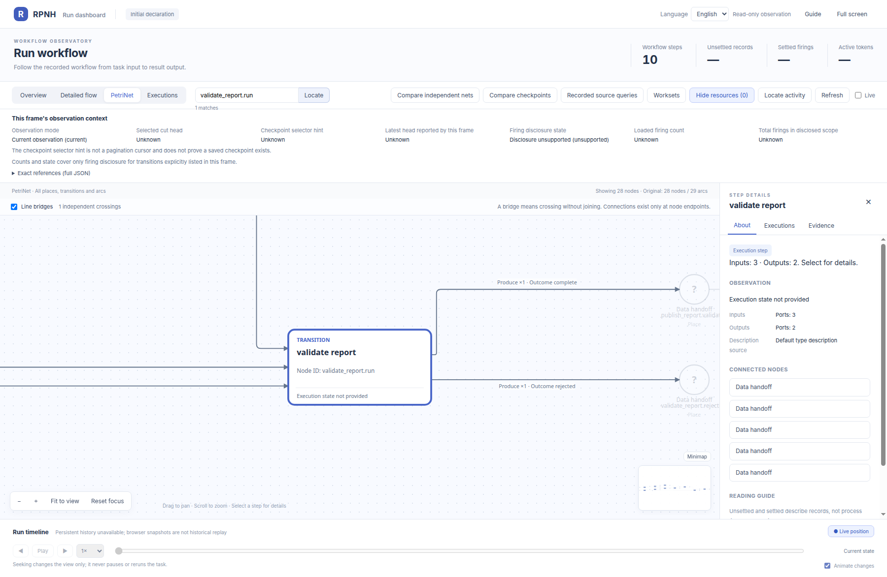

# tools_double_rejection: node details

English | [中文](README_ZH.md)

Official-viewer close-ups of each transition in the same initial PetriNet.

[Return to the complete PN gallery](../../README.md).

## check_tariff_input.run

## check_usage_input.run

## compute_cost.run

## join_intervals.run

## normalize_tariff.run

## normalize_usage.run

## publish_report.run

## read_tariff.run

## read_usage.run

## validate_report.run

