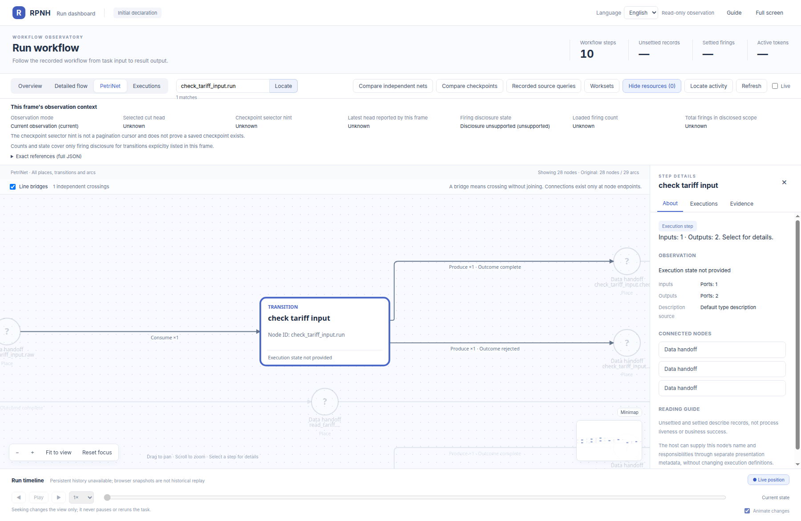
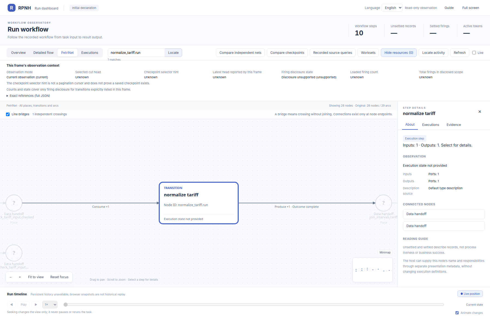
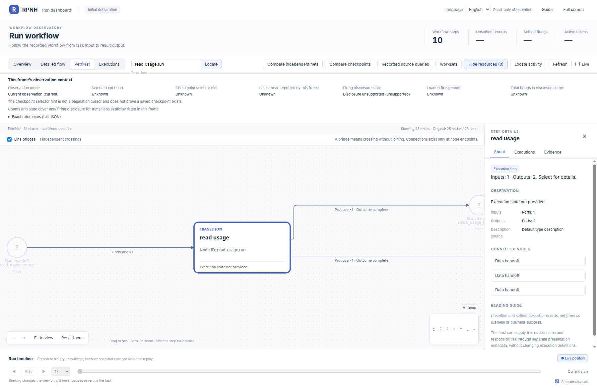
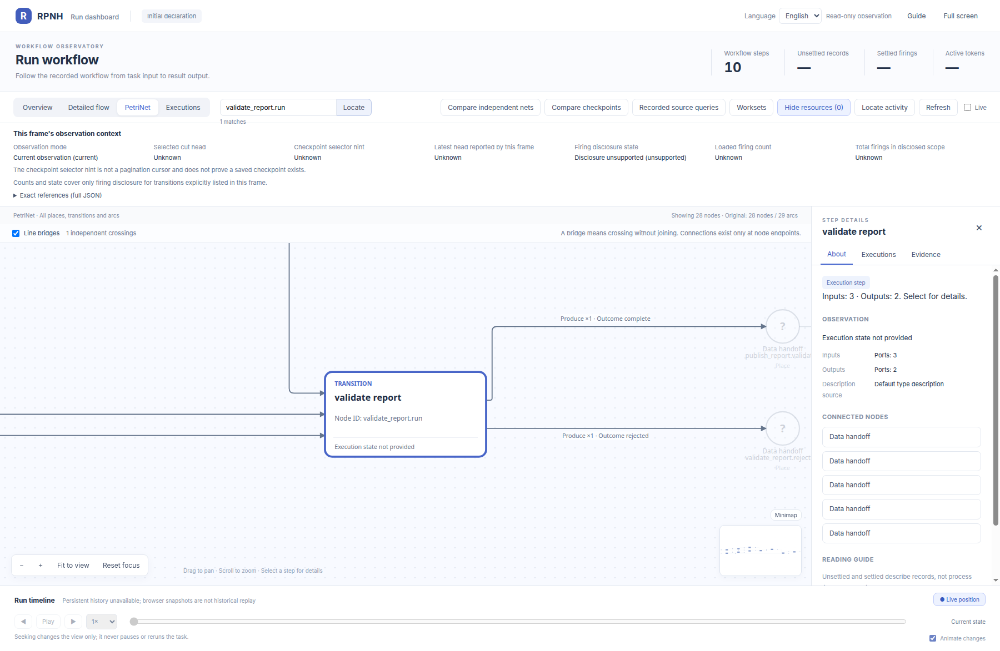

# tools_ten_operations：节点细节

[English](README.md) | 中文

同一初始 PetriNet 中各 transition 的官方 viewer 放大视图。

[返回完整 PN 图册](../../README_ZH.md)。

## check_tariff_input.run

## check_usage_input.run

## compute_cost.run

## join_intervals.run

## normalize_tariff.run

## normalize_usage.run

## publish_report.run

## read_tariff.run

## read_usage.run

## validate_report.run

